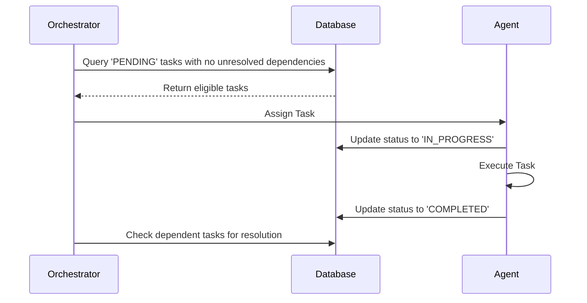

# Shared Task List

## Problem Statement
Currently, we lack a shared task list system to map agent responsibilities. We need database designs and sequence diagrams.

## Research Report
A strong shared task list maps out responsibilities using PostgreSQL in the cloud and SQLite locally.

## Design Doc
We will utilize `shared_tasks`, `task_dependencies`, and `swarm_tasks` tables. An orchestrator will query and assign available tasks based on the DAG dependencies.

### Database Design

- **`shared_tasks`**: Stores individual assignments including `id`, `organization_id`, `title`, `description`, `status` (e.g., 'PENDING', 'IN_PROGRESS', 'COMPLETED', 'BLOCKED'), `agent_id`, and `priority`.
- **`task_dependencies`**: Maps dependencies with `task_id` and `depends_on_task_id`.
- **`swarm_tasks`**: Extends shared tasks with a `mission_id` and `parent_plan_id`.

### Sequence Diagram

## Implementation Prompt
Please implement the underlying Go APIs for creating, reading, updating, and deleting shared tasks to match `srcs/server/db/migrations/021_kairos_orchestration.sql` and `srcs/server/db/migrations/008_swarm_tasks.sql` within `srcs/server/orchestration/tasks.go` and `srcs/server/db/`.

## Priority
P0

## Estimated Scope
Large
