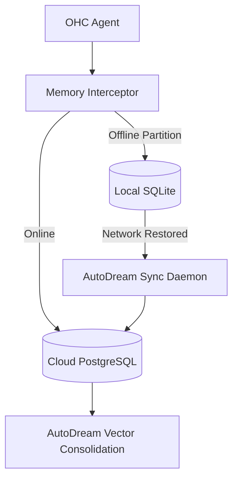

# Mission: Implementing the AutoDream Cloud-to-Local Context Sync Daemon

## Problem Statement
While OHC currently supports multiple modes (Cloud-Native Shared Service, Headless Cloud API, and Desktop Standalone), agents seamlessly fail when operating in a Thin Client mode that loses connection to the Cloud backend. We lack an offline-first mechanism to buffer MCP (Model Context Protocol) context and agent states to a local SQLite database (acting as a fallback SIPDB) during network partitions, and automatically synchronize that state back to the Cloud Postgres Vector DB (the "AutoDream" consolidation) once connectivity is restored. Replit, Claude Code, and OpenClaw lack this specific "Hybrid" cross-over feature.

## Research Report

### Competitive Audit Findings
The current landscape of agentic platforms focuses entirely on either pure-cloud or pure-local footprints:

| Platform | Local-First Capability | Cloud Multi-Tenancy | Automatic Offline State Sync | Notes |
|----------|------------------------|---------------------|------------------------------|-------|
| **Replit Agent** | Low (Bound to cloud VM) | High (Multi-tenant SaaS) | No (Requires constant net) | UI is excellent but strictly tied to Replit's remote infrastructure. |
| **Claude Code** | High (Runs on local CLI) | Low (No native orchestration) | No | Purely a CLI execution wrapper around the Anthropic API. |
| **OpenClaw** | Medium | Medium | No | Multi-agent chaining is present, but UI/API scaling is limited. |
| **OHC (Current)** | High (SQLite Standalone) | High (Postgres + Redis) | No | Currently binary: you are either fully cloud or fully standalone. |
| **OHC (Target)** | High | High | **Yes** | Transparent fallback and reconciliation of memory via AutoDream. |

### Architectural Gap
OHC needs an "AutoDream Sync Daemon" that intercepts vector memory additions and MCP tool executions. When the Cloud is unavailable, it writes to `local_sipdb.sqlite`. When connectivity is restored, it merges the SQLite WAL changes into the central PostgreSQL store.

## Design Doc

### Core Components
1. **`db.HybridProvider`**: A new database provider wrapper that attempts to write to the primary Cloud provider, and on timeout/failure, writes to the local SQLite provider.
2. **`sync.AutoDreamDaemon`**: A background Go routine (`srcs/server/sync/autodream_daemon.go`) that periodically polls the local SQLite instance for un-synced events and pushes them to the Cloud REST API/Postgres.
3. **Database Schema Update**: Add a `sync_status` column (enum: `PENDING`, `SYNCED`) to the local schema for relevant agent context tables to track what has been pushed to the cloud.

### API Contracts
*   **Sync Endpoint**: `POST /api/v1/sync/autodream` (Accepts an array of serialized memory events from the local client).

## Implementation Prompt

**To the Implementer Agent:**

You are tasked with building the AutoDream Sync Daemon to bridge OHC's Standalone and Cloud modes.

1.  **Create the Sync Daemon**: Create `srcs/server/sync/autodream_daemon.go`. Implement a background worker that scans a local SQLite instance for rows where `sync_status = 'PENDING'`.
2.  **Define the Payload**: Define the Go struct `AutoDreamSyncPayload` that contains MCP state and agent memory vectors.
3.  **Implement the API**: In `srcs/server/api/sync_handler.go`, add the handler for `POST /api/v1/sync/autodream` which accepts this payload and inserts it into the primary Postgres database.
4.  **Database Migration**: Ensure the local SQLite initialization scripts (likely in `srcs/server/db/sqlite.go`) include the `sync_status` column with a default of `'PENDING'` for offline writes.
5.  **Testing**: Write a comprehensive Go test suite (`srcs/server/sync/autodream_daemon_test.go`) that simulates a network partition, writes to the local mock, restores the network, and verifies the sync daemon successfully pushes to the mock Cloud provider.
6.  **Observability**: Ensure the sync daemon emits metrics (e.g., `telemetry.AutoDreamSyncsTotal.Add(...)` with nil checks) using the existing OpenTelemetry infrastructure.

Follow all Go testing conventions (e.g., `t.Setenv`) and ensure you do not break existing Bazel builds.

## Priority
P0

## Estimated Scope
Large

