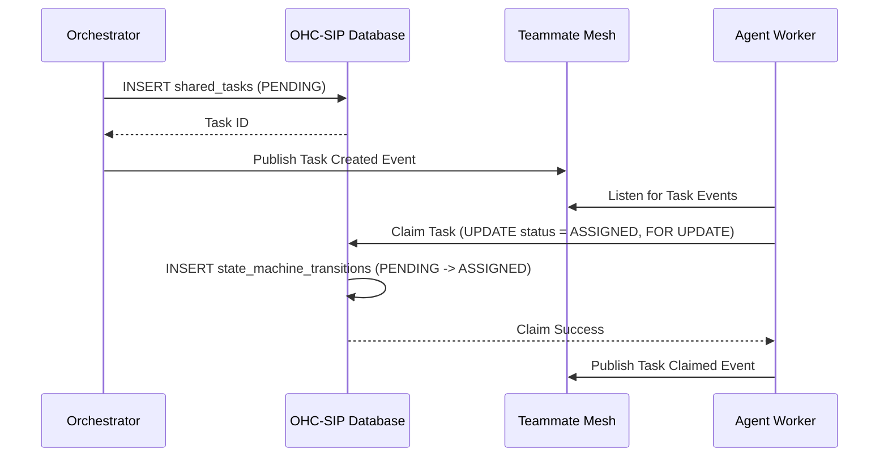
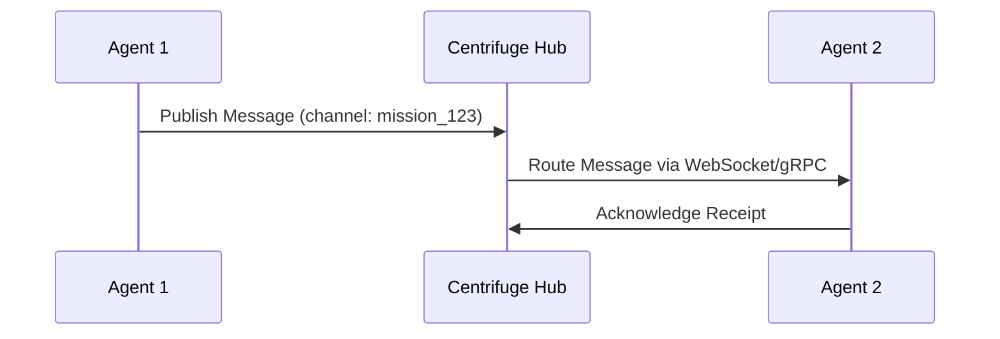
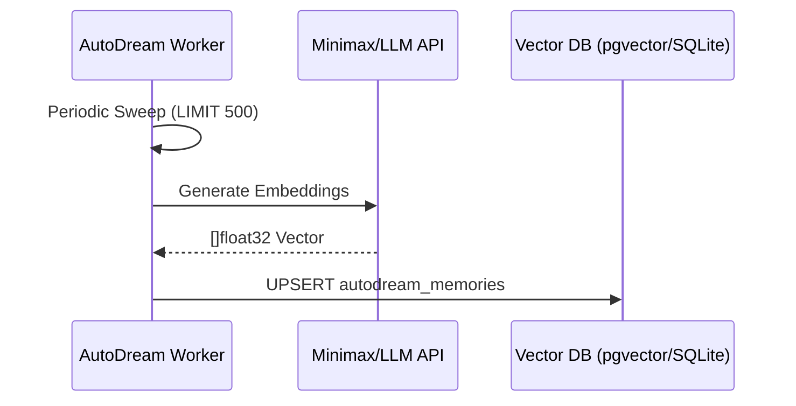

# 🚀 Mission: KAIROS Orchestrator

## 1. Problem Statement
The OHC swarm requires a highly resilient, observable, and autonomous coordination engine to scale. Currently, task delegation can be brittle, lacking a unified distributed state machine for dependency tracking. Moreover, long-term memory (AutoDream) needs robust, batch-oriented pipelines for Hybrid Architecture (Cloud pgvector + Standalone SQLite). We need an Implementer agent to bridge the gap between our high-level architecture designs and the concrete database schemas, queue interfaces, and API contracts.

## 2. Research Report
Our analysis of the KAIROS engine reveals three critical pillars needing immediate implementation:
- **Shared Task List & State Machine:** Agents currently coordinate ad-hoc. A robust Distributed State Machine (`docs/features/kairos/state_machine.md`) backed by `shared_tasks` and `state_machine_transitions` is required.
- **Sub-Agent Orchestration Queue:** High-concurrency task delegation needs a resilient queue. We must implement `sub_agent_jobs` (`docs/features/kairos/sub_agent_queue.md`).
- **AutoDream Pipeline:** Ephemeral session data must be consolidated into `autodream_memories` for long-term RAG search (`docs/features/kairos/autodream_pipeline.md`).

### Competitive Analysis
| Feature | Legacy Systems | OHC KAIROS |
| :--- | :--- | :--- |
| **State Tracking** | Local Only | Distributed (Redis + Postgres) / SQLite Fallback |
| **Memory** | Ephemeral | Persistent Vector DB (pgvector) |
| **Coordination** | HTTP Polling | Teammate Mesh (Pub/Sub) |

## 3. Design Doc

### 3.1 Architecture Sequence Diagrams

#### Shared Task List & Distributed State Machine

#### Teammate Mesh APIs (Centrifuge Integration)

#### AutoDream Data Pipeline

## 4. Implementation Prompt
**Attention Implementer Agent:** You are tasked with bringing the KAIROS Orchestrator schemas to life.

1. **Database Schema:** Create a new migration file `srcs/server/db/migrations/032_kairos_orchestrator_schema.sql` (verify sequence number). Include the schemas for:
   - `shared_tasks`
   - `task_dependencies`
   - `state_machine_transitions`
   - `sub_agent_jobs`
   - `autodream_memories`
   Ensure strict adherence to Hybrid Compatibility (Postgres + SQLite). Do not use `IF NOT EXISTS` on `ALTER TABLE ADD COLUMN`. Use `goose` migration formatting (`-- +goose Up` / `-- +goose Down`).
2. **Bazel Wiring:** Update `srcs/server/db/BUILD.bazel` to include your new migration file in the `embedsrcs` list.
3. **Verification:** Write a Go test (e.g., `srcs/server/orchestration/kairos_schema_test.go`) utilizing `db.NewSqliteProvider(sqliteDB)` to verify the schema initializes correctly without syntax errors.

**Priority:** P0
**Estimated Scope:** Large

