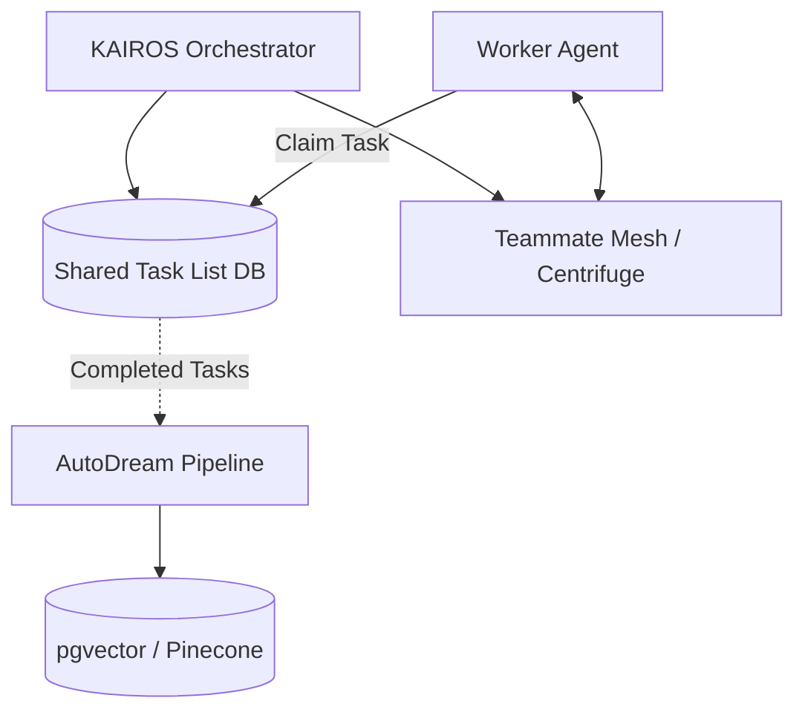

# 🚀 Shared Task List & KAIROS Orchestration
## Problem Statement
The OHC Hybrid Agentic OS requires an autonomous, resilient backbone to seamlessly decompose massive human goals into isolated, parallel agentic workflows. Without a coordinated "Shared Task List" and Realtime "Teammate Mesh", agents risk overlapping work, race conditions, and failing complex DAG dependencies.

## Research Report
The current architecture needs:
1. **Shared Task List (Decomposition):** A durable distributed state machine backed by PostgreSQL (`FOR UPDATE SKIP LOCKED`) in the Cloud and SQLite (with semaphores) in Standalone mode.
2. **Teammate Mesh (Orchestration):** A realtime event bus for intent broadcast via Redis Pub/Sub, Centrifugo for WebSocket degradation, and SPIFFE/SPIRE for identity validation.
3. **AutoDream (Consolidation):** A pipeline for semantic long-term memory via pgvector embedding asynchronous `.agent-task/memory/` findings.

## Design Doc
### Architecture

### Visual Excellence Mandate
Downstream UI interpretation MUST use safely scoped inline styles:
`
`

## Implementation Prompt
**Task:** Implement KAIROS Shared Task Orchestration
1. **File:** `srcs/server/orchestration/shared_task_db.go`
   - Implement `ClaimTask()` ensuring `FOR UPDATE SKIP LOCKED` for PG.
2. **File:** `srcs/server/orchestration/mesh_broadcast.go`
   - Implement `BroadcastTaskStatus()` sending `TASK_CLAIMED` over Centrifuge/Redis.
3. **File:** `srcs/server/autodream/pipeline.go`
   - Implement pipeline worker watching `.agent-task/memory/*.yml` files.

## Priority
P0

## Estimated Scope
Large
