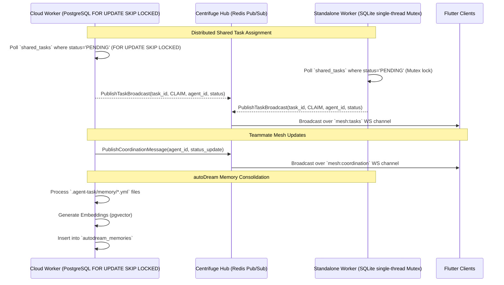

# OHC Distributed Teammate Mesh & Task Sequence

```mermaid
sequenceDiagram
    participant CloudWorker as Cloud Worker (PostgreSQL FOR UPDATE SKIP LOCKED)
    participant Centrifuge as Centrifuge Hub (Redis Pub/Sub)
    participant StandaloneWorker as Standalone Worker (SQLite single-thread Mutex)
    participant UI as Flutter Clients

    Note over CloudWorker, StandaloneWorker: Distributed Shared Task Assignment

    CloudWorker->>CloudWorker: Poll `shared_tasks` where status='PENDING' (FOR UPDATE SKIP LOCKED)
    StandaloneWorker->>StandaloneWorker: Poll `shared_tasks` where status='PENDING' (Mutex lock)

    CloudWorker-->>Centrifuge: PublishTaskBroadcast(task_id, CLAIM, agent_id, status)
    StandaloneWorker-->>Centrifuge: PublishTaskBroadcast(task_id, CLAIM, agent_id, status)

    Centrifuge->>UI: Broadcast over `mesh:tasks` WS channel

    Note over CloudWorker, UI: Teammate Mesh Updates

    CloudWorker->>Centrifuge: PublishCoordinationMessage(agent_id, status_update)
    Centrifuge->>UI: Broadcast over `mesh:coordination` WS channel

    Note over CloudWorker, StandaloneWorker: autoDream Memory Consolidation
    CloudWorker->>CloudWorker: Process `.agent-task/memory/*.yml` files
    CloudWorker->>CloudWorker: Generate Embeddings (pgvector)
    CloudWorker->>CloudWorker: Insert into `autodream_memories`
```
