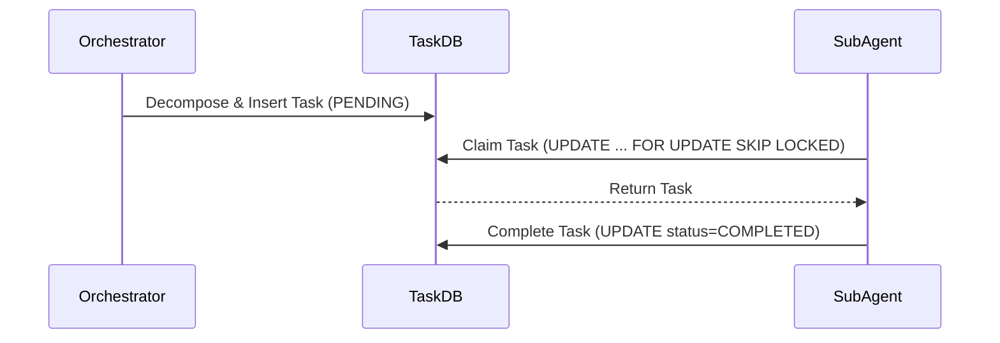

# Title: Implement Shared Task List Schema

## Problem Statement
The KAIROS orchestrator needs to decompose complex feature requests into a shared task list for the agent team. Currently, there is no robust backend database design and sequence diagram defining the Shared Task List.

## Research Report
The OHC Hybrid Agentic OS requires agents to execute autonomously but coordinate via a central state. The `ohc_tasks` state machine ensures exactly-once execution.

## Design Doc
We need to track task creation, status, assigned agent, and dependencies.
- `id`: UUID Primary Key
- `title`: String
- `description`: Text
- `status`: String (PENDING, RUNNING, COMPLETED, FAILED)
- `agent_id`: UUID
- `dependencies`: JSONB array of UUIDs
- `created_at`: Timestamp
- `updated_at`: Timestamp

## Implementation Prompt
1. Create database migration `srcs/server/db/migrations/035_kairos_shared_tasks.sql` defining `ohc_tasks`. Ensure SQLite compatibility (`id TEXT PRIMARY KEY`).
2. Add migration to `srcs/server/db/BUILD.bazel`.

## Priority
P0

## Estimated Scope
Medium

