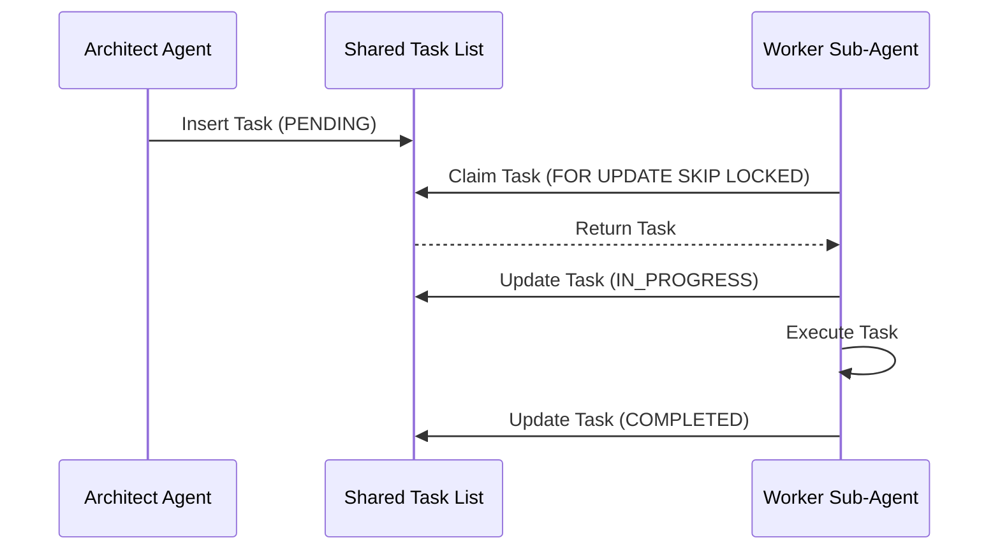

# Mission: Shared Task List (Decomposition & UltraPlan)

**Problem Statement**: The Swarm needs a robust database-backed state machine to track tasks and DAG dependencies without race conditions, supporting both Cloud and Standalone modes.

**Research Report**:
- Cloud mode requires PostgreSQL `FOR UPDATE SKIP LOCKED`.
- Standalone mode requires SQLite transactions/mutexes.
- Must log transitions in `state_machine_transitions`.

**Design Doc**:
- Tables: `shared_tasks_v4`, `sub_agent_queue`.
- States: PENDING -> ASSIGNED -> IN_PROGRESS -> REVIEW -> COMPLETED | FAILED.
- Sequence Diagram:

**Implementation Prompt**:
- Create Go repository interfaces for task state transitions using `rueidis` locks (Cloud) and SQLite mutexes (Standalone).
- Implement atomic transition methods mapping to `state_machine_transitions`.

**Priority**: P0
**Estimated Scope**: Large

