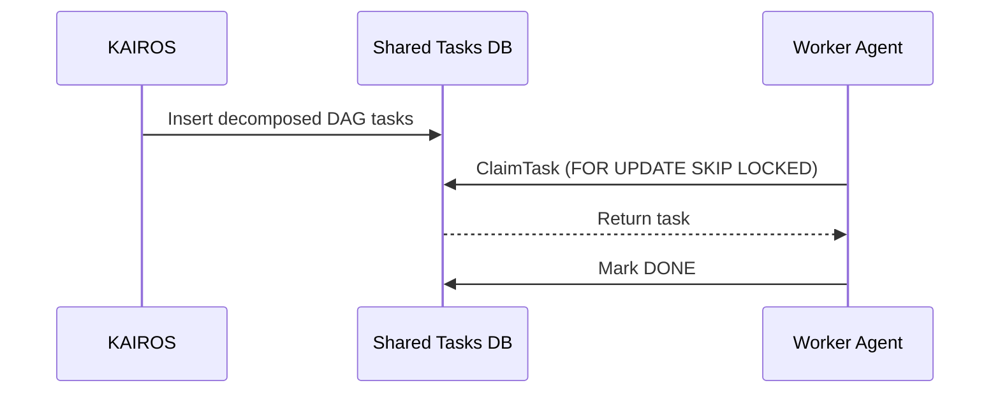

# Title: KAIROS: Phase 1-4 Master Architecture Design

## Problem Statement
The OHC Hybrid Agentic OS requires KAIROS Orchestration to manage Shared Task Lists, Teammate Mesh, and AutoDream pipelines. Without a unified design document synthesizing these phases, sub-agents lack the technical blueprint to implement these complex features correctly across cloud-native (PostgreSQL/Redis) and standalone (SQLite) modes.

## Research Report
The KAIROS Orchestrator must define the structural and aesthetic vision for the OHC "Hybrid Agentic OS", acting as the central orchestrator that decomposes complex feature requests into a shared task list.

**Phase 1: Shared Task List**
We need a robust backend datastore for the "Shared Task List" feature. We need SQL migrations that work on both Postgres (Cloud Mode) and SQLite (Standalone Mode). The schema must track task hierarchy, state (`PENDING`, `ASSIGNED`, `IN_PROGRESS`, `DONE`, `BLOCKED`), and assignments, and enforce tenant isolation.

**Phase 2: Teammate Mesh APIs**
For realtime agent coordination, we need a high-throughput, low-latency communication bus. We will use WebSockets for full-duplex communication and Redis Pub/Sub (`rueidis`) for broad network event distribution in Cloud Mode. In Standalone Mode, an in-memory Go channel event bus suffices.

**Phase 3: autoDream Data Pipeline**
We need to consolidate completed task data into a Vector DB for long-term "semantic memory". In Cloud Mode, we use `pgvector` with HNSW index. In Standalone Mode, we serialize embeddings as BLOBs and compute cosine similarity in-memory.

## Design Doc
### 1. The Shared Task List (The Brain)
**Table:** `shared_tasks`
- `id` (TEXT, Primary Key)
- `organization_id` (TEXT)
- `parent_plan_id` (TEXT)
- `title` (TEXT)
- `description` (TEXT)
- `status` (TEXT)
- `agent_id` (TEXT, Nullable)
- `dependencies` (TEXT / JSON)
- `created_at` (TIMESTAMP)
- `updated_at` (TIMESTAMP)

**Degradation Strategy:**
- **Cloud-Native (PostgreSQL):** Uses `SELECT ... FOR UPDATE SKIP LOCKED` to allow highly concurrent, pod-level orchestration.
- **Standalone (SQLite):** Degrades to application-level `sync.Mutex` and basic `UPDATE` transactions.

### Sequence Diagram

### 2. Teammate Mesh (The Nerves)
**API Endpoints:**
- `GET /api/v1/mesh/ws`: WebSocket upgrader for agent connections.
- `POST /api/v1/mesh/publish`: HTTP endpoint to publish a message.

**Channels:** `mesh:tasks`, `mesh:coordination`, `mesh:capabilities`

**Degradation Strategy:**
- **Cloud-Native:** Uses `rueidis` (Redis Pub/Sub) and `CentrifugeNode`.
- **Standalone:** Uses in-memory Go channels for fast, local IPC.

### 3. autoDream (The Memory)
**Table:** `consolidated_memory`
- `id` (TEXT, Primary Key)
- `organization_id` (TEXT)
- `agent_id` (TEXT)
- `content` (TEXT)
- `embedding` (VECTOR(1536) / BLOB)
- `source_type` (TEXT)
- `created_at` (TIMESTAMPTZ)

**Worker Job:**
- An `AutoDreamWorker` polls `shared_tasks` where `status = 'DONE'`.
- Uses Minimax API to synthesize task logs.
- Uses Embeddings API to generate a vector.
- Upserts to `consolidated_memory`.

**Degradation Strategy:**
- **Cloud-Native:** `pgvector` with HNSW index for `vector_cosine_ops`.
- **Standalone:** Embeddings serialized as BLOBs; cosine similarity performed in-memory via application logic.

## Implementation Prompt
**Role**: Implementer Agent
**Task**: Implement the KAIROS Orchestration master architecture detailed above.
**Instructions**:
1. Implement the Shared Task List database schema migrations (for both Postgres and SQLite) and repository methods (`srcs/server/repository/task_repo.go`). Enforce tenant isolation using `OrganizationIDFromContext(ctx)`.
2. Build the Teammate Mesh APIs, implementing `RedisPubSub` and `MemoryPubSub` backplanes, and WebSocket/HTTP handlers in `srcs/server/api/mesh/`. Ensure SPIFFE/SPIRE authentication.
3. Implement the autoDream Data Pipeline, including `consolidated_memory` migrations and the `AutoDreamWorker` in `srcs/server/workers/autodream.go`.
4. Ensure comprehensive unit test coverage (>90%) for all new features.
**Acceptance Criteria**:
*   Migrations apply cleanly in both Cloud and Standalone modes.
*   Teammate Mesh supports WebSocket connections and real-time broadcasting.
*   AutoDreamWorker successfully processes completed tasks and generates mock embeddings.

## Priority
P0

## Estimated Scope
Large

