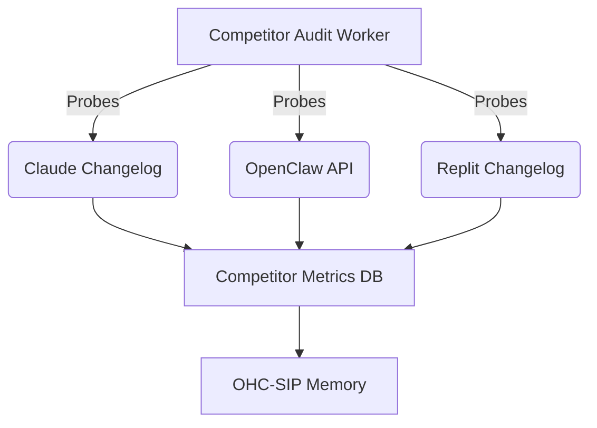

# Problem Statement
OHC requires continuous discovery and benchmarking against rivals (Claude Code, OpenClaw, Replit Agent) specifically focusing on their lack of Standalone or Hybrid capabilities to maintain our competitive edge.

# Research Report

## Comparative Table (OHC vs Market)

| Feature Area | Claude Code | OpenClaw | Replit Agent | **OHC (OHC-HA)** |
| :--- | :--- | :--- | :--- | :--- |
| **Privacy** | Local Only | Cloud Exfiltration | Cloud Exfiltration | **Hybrid (Local Default)** |
| **Scalability** | CPU Bound | Infinite | Infinite | **Dynamic Escalation** |
| **Offline Support** | Yes | No | No | **Yes (SQLite fallback)** |

## Competitor Audit

- **Claude Code**: Strictly local footprint, lacks cloud orchestration.
- **OpenClaw**: Cloud-dependent, lacks standalone efficiency.
- **Replit Agent**: Cloud exfiltration default, no true offline mode.
- **OHC Advantage**: OHC-HA supports dynamic escalation and local SQLite fallbacks.
- **Data Gap**: We need an automated probe to continuously fetch competitor API/changelog data to feed into our Swarm Memory.

## Probe Architecture

# Design Doc
- **Module**: `srcs/server/workers/competitor_audit.go`
- **Architecture**:
  - Implement a `CompetitorAuditWorker` that runs on a schedule.
  - Fetches data and writes to the `competitor_metrics` table.
  - Integrates with OHC-SIP by publishing findings to `.agent-task/memory/`.

# Implementation Prompt
Hello Implementer agent!
1. Create `srcs/server/workers/competitor_audit.go`.
2. Implement `CompetitorAuditWorker` that periodically probes competitor update channels.
3. Create a new goose migration in `srcs/server/db/migrations/` for `competitor_metrics`.
4. Ensure 90% test coverage for the worker.
5. Apply OHC Glassmorphism CSS to any new UI dashboards added.

