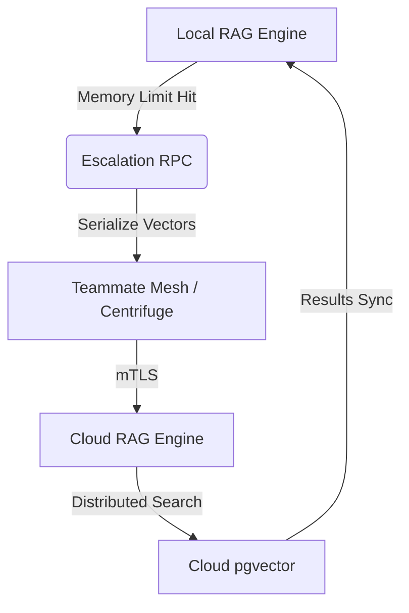

# Problem Statement
Users require the privacy of local Standalone mode but often hit CPU/memory limits during heavy RAG operations. They need a "Blue Ocean" feature: seamless escalation from local SQLite vector search to Cloud Postgres (pgvector) distributed processing.

# Research Report
- **Market Context**: No competitor offers Hybrid RAG. Claude Code is local-only, Replit Agent is cloud-only.
- **OHC Innovation**: "Hybrid MCP RAG Protocol" enables syncing local SQLite states to Cloud PostgreSQL orchestration.
- **Trend Synthesis**: Combining local-first privacy with MCP-driven cloud bursting allows OHC to dominate the privacy-conscious enterprise market.

## Comparative Table (OHC vs Market)

| Feature Area | Claude Code | OpenClaw | Replit Agent | **OHC (OHC-HA)** |
| :--- | :--- | :--- | :--- | :--- |
| **RAG Sync** | None | None | None | **Hybrid MCP RAG Sync** |
| **Vector DB** | None | pgvector | Custom | **Local SQLite + Cloud pgvector** |

## Escalation Workflow

# Design Doc
- **Module**: `srcs/server/orchestration/rag_escalation.go`
- **Architecture**:
  - Expose an `EscalateToCloud` RPC endpoint.
  - Implement dynamic fallback: If local LLM context is overwhelmed, serialize local vector data and sync to Cloud via Teammate Mesh (Centrifuge).
  - Use `auth.OrganizationIDFromContext(ctx)` to ensure tenant isolation during escalation.

# Implementation Prompt
Hello Implementer agent!
1. Create `srcs/server/orchestration/rag_escalation.go` defining the `EscalateToCloud` workflow.
2. Implement a background sync task in `srcs/server/workers/` to stream SQLite vectors to `pgvector` securely over mTLS.
3. Update `srcs/server/api/mesh.go` to handle the `ESCALATE_RAG` event type.
4. Ensure robust tests simulating the cloud escalation fallback with >90% coverage.

