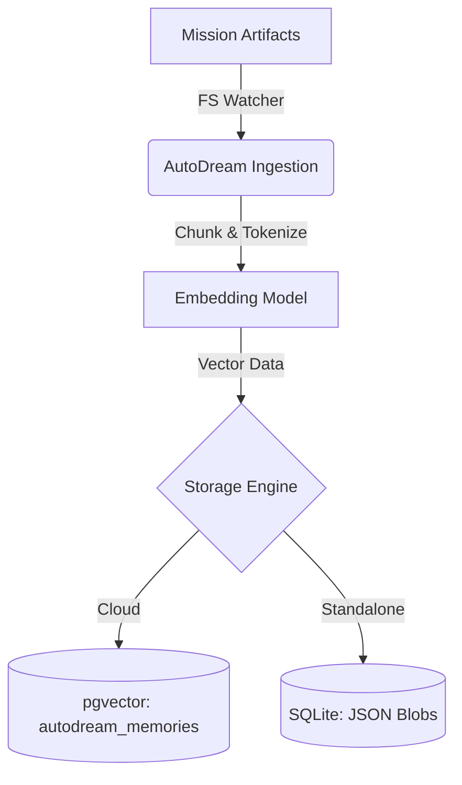

# Problem Statement
Research artifacts and mission briefs defining OHC's hybrid evolution are stored as Markdown in `.agent-task/missions/`, but they are not automatically consolidated into the `autodream_memories` vector database for swarm semantic search.

# Research Report
- **Durable State Mandate**: The AutoDream architectural consolidation requires that all findings be vectorized into pgvector (Cloud) or SQLite JSON blobs (Standalone).
- **Gap**: The current AutoDream pipeline primarily sweeps `agent_session_data` and `.agent-task/memory/`, ignoring `.agent-task/missions/` artifacts.

## Comparative Table (OHC vs Market)

| Feature Area | Claude Code | OpenClaw | Replit Agent | **OHC (OHC-HA)** |
| :--- | :--- | :--- | :--- | :--- |
| **Artifact Ingestion** | None | Cloud Only | Cloud Only | **Local + Cloud Vectorization** |

## Ingestion Architecture

# Design Doc
- **Module**: `srcs/server/workers/mission_ingestion.go`
- **Architecture**:
  - Extend the `AutoDreamWorker` daemon to also watch `.agent-task/missions/*.md`.
  - Chunk Markdown content, generate embeddings via LLM providers, and store them in the database.
  - Graceful degradation: Check `dbWrapper.Provider().IsSQLite()` to fall back to JSON blobs if pgvector is unavailable.

# Implementation Prompt
Hello Implementer agent!
1. Create `srcs/server/workers/mission_ingestion.go`.
2. Add a filesystem watcher for `.agent-task/missions/` that triggers AutoDream ingestion on new or modified files.
3. Parse the Markdown content (stripping HTML glassmorphism tokens safely) and vectorize the text.
4. Write comprehensive unit tests for the ingestion logic.

