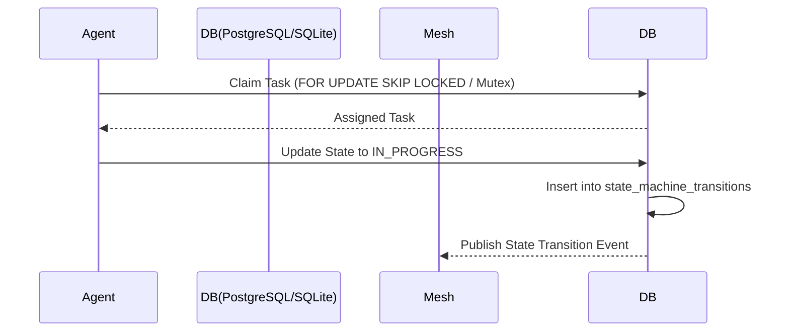

<div markdown="1" style="backdrop-filter: blur(20px) saturate(200%); font-family: 'Outfit', 'Inter', sans-serif; background: rgba(255, 255, 255, 0.03); color: #fff; padding: 20px; border-radius: 12px; border: 1px solid rgba(255, 255, 255, 0.1);">

# Title: KAIROS: Implement Hybrid Agentic OS Orchestration Master Plan

## Problem Statement
The One Human Corp (OHC) Swarm currently lacks a fully integrated, robust orchestration engine that can seamlessly bridge Cloud-Native environments and Standalone Desktop deployments. We need to unify the Shared Task List, Teammate Mesh, and AutoDream memory consolidation into a cohesive "Hybrid Agentic OS" that degrades gracefully when not in Cloud Mode.

## Research Report
- **Market Reality:** Competitors like Claude Code and Replit Agent either run purely locally (sacrificing scale) or purely in the cloud (sacrificing privacy and offline capability).
- **OHC's Unfair Advantage:** By leveraging a Hybrid Architecture (OHC-HA), we can scale horizontally using PostgreSQL/Redis in the cloud while degrading gracefully to SQLite in standalone mode.
- **KAIROS Orchestrator:** Requires a three-pillar architecture:
  1. **Shared Task List:** For robust state machine tracking and DAG-based sub-agent decomposition.
  2. **Teammate Mesh:** For real-time, low-latency agent coordination via Redis Pub/Sub.
  3. **AutoDream Pipeline:** For transforming ephemeral coordination events into long-term vector embeddings (`pgvector` / local vector abstraction).

## Design Doc

### 1. Shared Task List (Decomposition & State Machine)
**Schema (PostgreSQL & SQLite Compatible):**
```sql
CREATE TABLE IF NOT EXISTS shared_tasks_v4 (
    id VARCHAR PRIMARY KEY,
    organization_id VARCHAR NOT NULL,
    title VARCHAR NOT NULL,
    description TEXT,
    status VARCHAR NOT NULL DEFAULT 'PENDING',
    agent_id VARCHAR,
    priority VARCHAR NOT NULL DEFAULT 'P2',
    payload TEXT,
    parent_plan_id TEXT,
    dependencies TEXT NOT NULL DEFAULT '[]',
    created_at TIMESTAMP WITH TIME ZONE DEFAULT CURRENT_TIMESTAMP,
    updated_at TIMESTAMP WITH TIME ZONE DEFAULT CURRENT_TIMESTAMP
);
```

**State Machine Tracking Sequence Diagram:**


### 2. Teammate Mesh APIs (Orchestration)
Realtime communication layer for agent coordination.
- **Channels:** `mesh:tasks`, `mesh:coordination`, `mesh:ultraplan`.
- **API Contracts:** High-level pub/sub interface utilizing the `Message` struct for broadcast capability over Redis and in-memory local channels.

### 3. AutoDream Data Pipelines (Memory Consolidation)
Asynchronous background job for continuous memory consolidation.
- **Pipeline:**
  1. Poll `state_machine_transitions` for `COMPLETED` tasks.
  2. Summarize task outcome via local LLM or cloud API.
  3. Generate embeddings (1536-dimensional).
  4. Upsert into `autodream_memories` using `pgvector` or local equivalent.

## Implementation Prompt
Hello Implementer agent! Your mission is to implement the KAIROS Master Orchestration Plan.
1. Implement the Shared Task List database schema migrations (`shared_tasks_v4` and `sub_agent_queue`) in `srcs/server/db/migrations/` using Goose annotations.
2. Implement the `SharedTaskOrchestrator` in `srcs/server/orchestration/tasks_db.go` to handle the state machine tracking and DAG dependencies using `FOR UPDATE SKIP LOCKED` (Postgres) or Mutex (SQLite).
3. Implement the Teammate Mesh APIs in the `srcs/server/orchestration/` package to support the `Message` struct and Pub/Sub over Redis and in-memory.
4. Architect the AutoDream Pipeline in `srcs/server/orchestration/autodream_pipeline.go` to process completed tasks and commit embeddings to `autodream_memories`.
5. Ensure >90% test coverage across all orchestration modules (`bazelisk test //srcs/server/orchestration/...`).
6. All changes must respect the OHC Hybrid Architecture (OHC-HA) constraints and degrade gracefully in Standalone Mode.

## Priority
P0

## Estimated Scope
Large

</div>
