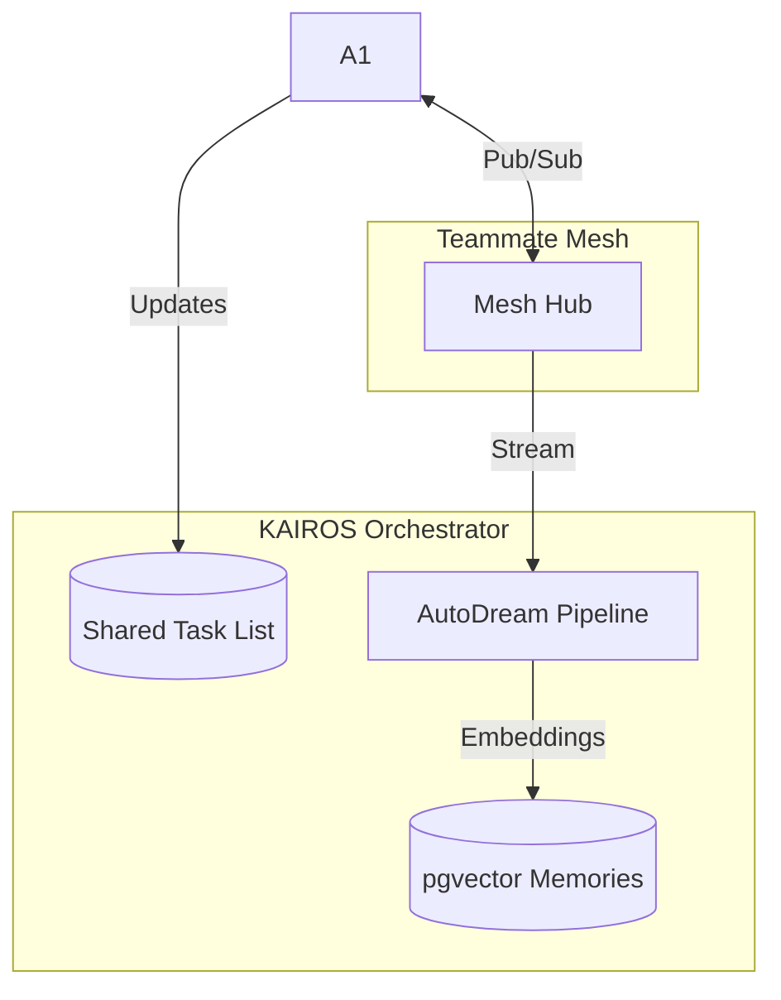

# Title: Implement KAIROS Triad: Shared Task List, Teammate Mesh, and AutoDream Pipeline

## Problem Statement
The One Human Corp (OHC) Swarm requires a durable database schema and microservices mapping to decompose high-level feature requests. The system currently lacks a unified architectural implementation of the KAIROS Orchestration layer, including the Shared Task List (PostgreSQL distributed state machine), Teammate Mesh (Redis Pub/Sub), and AutoDream (pgvector embeddings).

## Research Report
Based on `CLAUDE_OHC.md` and the hybrid architecture model:
- **Cloud-Native Mode**: Requires PostgreSQL for task claiming (`FOR UPDATE SKIP LOCKED`) and Redis for high-concurrency Pub/Sub.
- **Standalone Mode**: Must degrade gracefully to SQLite and in-memory communication.
- **AutoDream**: Ephemeral session logs must be compressed via Minimax LLMs and embedded into a pgvector index (`autodream_memories`).

## Design Doc
### KAIROS Triad
1. **Shared Task List**: A distributed state machine in PostgreSQL for tracking tasks and dependencies.
2. **Teammate Mesh**: Highly available low-latency communication layer using Redis.
3. **AutoDream Pipeline**: Minimax LLMs compress session logs and embed into a pgvector index.

## Implementation Prompt
Hello Implementer! Your mission is to implement the KAIROS Triad in `srcs/server/orchestration`.
1. Architect the database schema (e.g., PostgreSQL) for the Shared Task List.
2. Build scalable background queuing logic (e.g., BullMQ, Celery equivalent in Go) for sub-agents.
3. Design a distributed state machine backed by database locks/Redis.
4. Architect the Realtime Teammate Mesh APIs (e.g., WebSockets, gRPC, Redis Pub/Sub).
5. Architect the AutoDream data pipeline (pgvector, LLM embeddings).
6. Run `bazelisk test //srcs/server/orchestration/... --test_timeout=3000` to verify your code.

## Priority
P0

## Estimated Scope
Large

