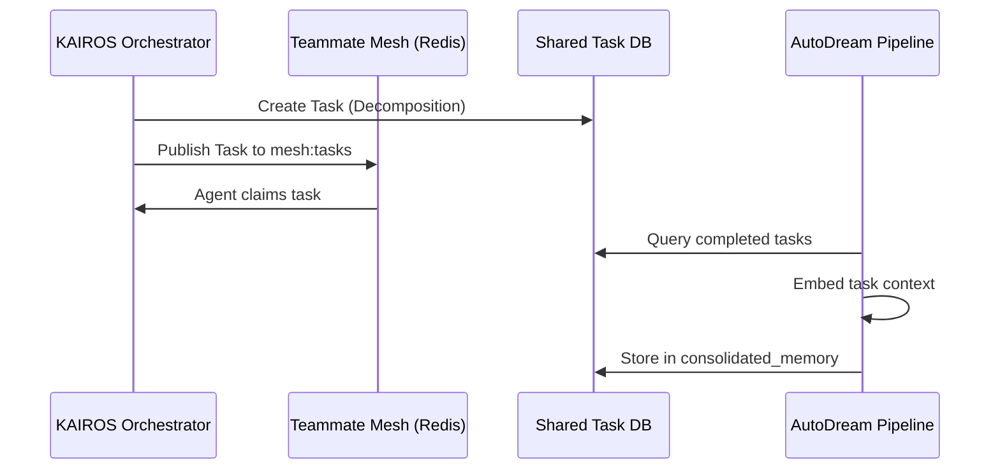

<div markdown="1" style="backdrop-filter: blur(20px) saturate(200%); font-family: 'Outfit', 'Inter', sans-serif; background: rgba(255, 255, 255, 0.03); color: #fff; padding: 20px; border-radius: 12px; border: 1px solid rgba(255, 255, 255, 0.1);">
# Title: KAIROS: Orchestrate Hybrid Agentic OS Core
## Problem Statement: The OHC swarm requires a robust coordination and memory system to decompose tasks, communicate via Pub/Sub, and consolidate findings into a durable vector store.
## Research Report: Based on the OHC-HA architecture, we need a Shared Task List (PostgreSQL FOR UPDATE SKIP LOCKED / SQLite fallback), a Teammate Mesh (Redis Pub/Sub on mesh:tasks and mesh:coordination), and an autoDream pipeline (inserting embeddings into consolidated_memory using pgvector).
## Design Doc:
### Architecture:
- **Shared Task List**: A centralized state machine backed by a shared_tasks table.
- **Teammate Mesh**: Realtime communication via WebSockets/Redis Pub/Sub.
- **autoDream**: Vector ingestion into consolidated_memory.
### Database Schema:
```sql
CREATE TABLE IF NOT EXISTS shared_tasks (
    id UUID PRIMARY KEY,
    title VARCHAR(255) NOT NULL,
    status VARCHAR(50) NOT NULL,
    agent_id UUID,
    created_at TIMESTAMP DEFAULT CURRENT_TIMESTAMP
);
```
### Sequence Diagram:

## Implementation Prompt: Implement the shared_tasks table, Redis Pub/Sub channels (mesh:tasks, mesh:coordination), and AutoDream vector pipeline targeting consolidated_memory. Ensure SQLite fallback for Standalone Mode.
## Priority: P0
## Estimated Scope: Large
</div>
