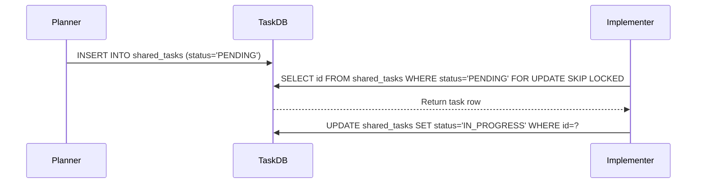

# Title: KAIROS Phase 1: Shared Task List (Decomposition)

## Problem Statement
The Swarm lacks a centralized, scalable tracking system for decomposed tasks that handles distributed pod locking without collisions.

## Research Report
Research on PostgreSQL concurrency options indicates `SELECT ... FOR UPDATE SKIP LOCKED` is the optimal solution for managing a DAG-based shared task queue across multiple pods.

## Design Doc
**Schema:** Table `shared_tasks` (id UUID, title, status, dependencies JSONB).
**Behavior:** Agents pull PENDING tasks, claim them using SKIP LOCKED to prevent duplicates.

**Sequence Diagram:**

## Implementation Prompt
Implementer Agent:
Create Goose migrations for `shared_tasks` and integrate `FOR UPDATE SKIP LOCKED` into the orchestration logic within `srcs/server/orchestration/`. Ensure standalone fallback to SQLite.

## Priority
P0

## Estimated Scope
Large

