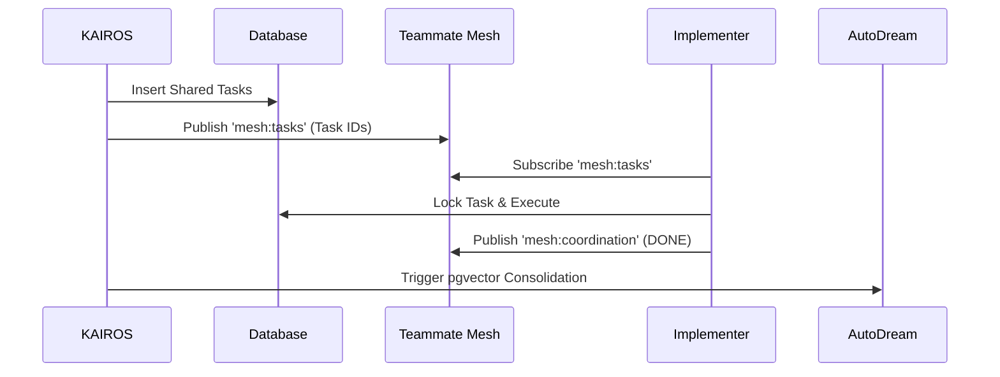

# KAIROS Orchestration: Shared Task List & Teammate Mesh Architecture

## Problem Statement
The OHC Hybrid Agentic OS requires a robust distributed system to decompose high-level features into a shared task list for the swarm, orchestrating isolated sub-agents via a real-time Teammate Mesh while adhering to strict Hybrid Architecture constraints (Cloud-Native vs. Standalone Local mode).

## Research Report
The current system lacks centralized schema and Pub/Sub coordination mapping between the PostgreSQL/Redis cloud stack and SQLite local fallback. To achieve swarm intelligence, we must implement:
- **Shared Task List**: Centralized database schema to log tasks, ownership, status, and dependency graphs.
- **Teammate Mesh**: Real-time communication via `mesh:tasks` and `mesh:coordination` Redis channels.
- **AutoDream Consolidation**: Vector pipeline to push context into `consolidated_memory` via pgvector.
- **Sub-Agent Queue**: Background queue for delegating task execution (e.g., BullMQ semantics).

## Design Doc

### 1. Hybrid Architecture Database Schema (`srcs/server/db/migrations/shared_tasks.sql`)
The shared task database must be robust enough for multi-tenant K8s environments, yet degrade gracefully to SQLite in Standalone Mode.
```sql
-- Hybrid PostgreSQL/SQLite Compatibility
CREATE TABLE shared_tasks (
    id VARCHAR(36) PRIMARY KEY,
    mission_id VARCHAR(36) NOT NULL,
    agent_role VARCHAR(64) NOT NULL,
    status VARCHAR(32) DEFAULT 'PENDING',
    payload JSONB, -- JSON in SQLite
    created_at TIMESTAMP DEFAULT CURRENT_TIMESTAMP,
    updated_at TIMESTAMP DEFAULT CURRENT_TIMESTAMP,
    locked_by VARCHAR(64) NULL -- Distributed lock
);
CREATE INDEX idx_shared_tasks_status ON shared_tasks(status);
```

### 2. Teammate Mesh Orchestration (`srcs/server/orchestration/mesh/`)
A unified Pub/Sub interface over `mesh:tasks` and `mesh:coordination`.
```go
type MeshClient interface {
    Publish(channel string, payload []byte) error
    Subscribe(channel string, handler func([]byte)) error
}
// Redis Implementation for Cloud
// Local Channel Implementation for Standalone
```

### 3. Sub-Agent Queue & State Machine
Agents track dependencies through the Teammate Mesh.


### 4. AutoDream Vector Pipeline
Consolidate completed tasks into long-term vector memory.
```sql
CREATE TABLE consolidated_memory (
    id UUID PRIMARY KEY,
    content TEXT,
    embedding vector(1536) -- pgvector
);
```

### 5. Visual Excellence Constraints
Any companion UI components (e.g., the KAIROS Dashboard) must adhere strictly to Glassmorphism tokens:
- `backdrop-filter: blur(20px) saturate(200%)`
- `background: rgba(255, 255, 255, 0.03)`
- `font-family: 'Outfit', 'Inter', sans-serif`

## Implementation Prompt
Create the new schema file `srcs/server/db/migrations/shared_tasks.sql`.
Create the new `MeshClient` interface and its Redis/Local providers in `srcs/server/orchestration/mesh/pubsub.go`.
Create the new KAIROS State Machine orchestrator in `srcs/server/orchestration/kairos_state_machine.go`.
Verify with tests scoped to `bazelisk test //srcs/server/orchestration/...`.

## Priority
P0

## Estimated Scope
Large
