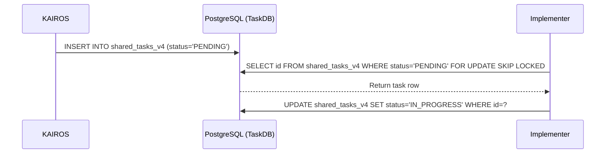

# KAIROS Phase 1: Shared Task List (Decomposition)
**Problem Statement**: Complex feature requests require decomposition into a DAG of sub-tasks stored in a robust distributed state machine to coordinate parallel execution.
**Research Report**: The KAIROS master plan dictates that task management should happen via PostgreSQL for cloud and SQLite for standalone.
**Design Doc**:
Database schema for `shared_tasks_v4`:
```sql
CREATE TABLE IF NOT EXISTS shared_tasks_v4 (
    id UUID PRIMARY KEY DEFAULT gen_random_uuid(),
    organization_id VARCHAR NOT NULL,
    title VARCHAR NOT NULL,
    description TEXT,
    status VARCHAR NOT NULL DEFAULT 'PENDING',
    agent_id VARCHAR,
    priority VARCHAR NOT NULL DEFAULT 'P2',
    payload JSONB,
    parent_plan_id TEXT,
    dependencies JSONB NOT NULL DEFAULT '[]',
    created_at TIMESTAMP WITH TIME ZONE DEFAULT CURRENT_TIMESTAMP,
    updated_at TIMESTAMP WITH TIME ZONE DEFAULT CURRENT_TIMESTAMP
);
```
State transition logic involves `FOR UPDATE SKIP LOCKED` inside transactions to safely pick tasks.
Sequence Diagram:

**Implementation Prompt**: Create the necessary database migration for the `shared_tasks_v4` schema and implement gRPC/REST APIs to fetch and claim pending tasks. Use Redis locks. Follow the Visual Excellence mandate for the task UI.
**Priority**: P0
**Estimated Scope**: Large
