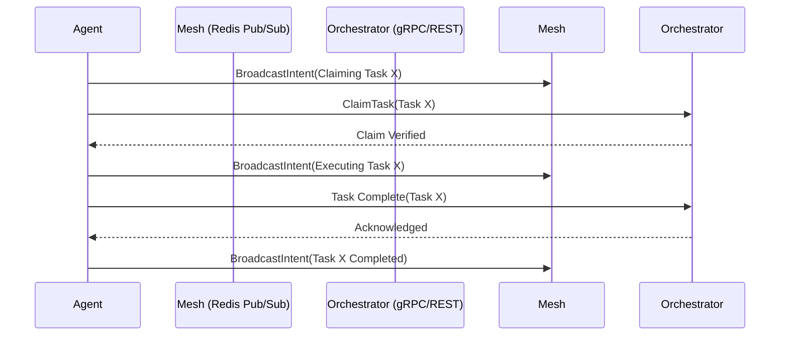

# KAIROS Phase 2: Realtime Teammate Mesh APIs (Orchestration)
**Problem Statement**: Sub-agents lack a low-latency method to synchronize states, coordinate locks, and broadcast events.
**Research Report**: Current coordination relies solely on delayed REST polling. A high-throughput pub/sub layer is required.
**Design Doc**:
Integrate Centrifuge websockets and Redis Pub/Sub channels (e.g., `mesh:tasks`, `mesh:coordination`) for cloud mode. Implement in-memory channels for local standalone mode. Ensure mTLS and SPIFFE/SPIRE SVID authentication.
API Contracts:
- HTTP POST `/mesh/broadcast`
- gRPC `AdvertiseCapabilities(AgentCapabilities)`
- gRPC `DiscoverAgents(Query)`
- gRPC `StreamMeshEvents(EventStreamRequest)`
Sequence Diagram:

**Implementation Prompt**: Create a new file `srcs/server/orchestration/hub.go` and implement the `MeshTransport` interface with `RedisMeshTransport` and `MemoryMeshTransport`. Establish gRPC endpoints `AdvertiseCapabilities` and `StreamMeshEvents`.
**Priority**: P0
**Estimated Scope**: Large
