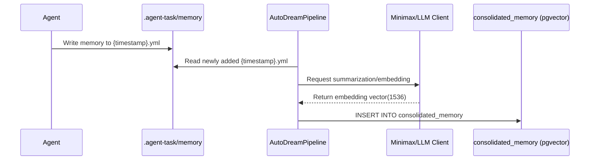

# KAIROS Phase 3: AutoDream Vector Data Pipelines
**Problem Statement**: Agent state in `.agent-task/memory/*.yml` is ephemeral and disconnected, leading to context-window overflows and memory gaps.
**Research Report**: Using pgvector with a long-running pipeline can effectively consolidate context into exact Nearest Neighbor queries.
**Design Doc**:
Database schema for `consolidated_memory`:
```sql
CREATE TABLE IF NOT EXISTS consolidated_memory (
    id TEXT PRIMARY KEY,
    organization_id TEXT NOT NULL,
    agent_id TEXT,
    content TEXT NOT NULL,
    embedding vector(1536),
    source_type TEXT NOT NULL,
    created_at TIMESTAMPTZ DEFAULT CURRENT_TIMESTAMP
);
CREATE INDEX ON consolidated_memory USING hnsw (embedding vector_l2_ops);
```
Construct a background worker, `AutoDreamPipeline`, to parse memory sources, summarize via an LLM client, and insert into the vector table.
Sequence Diagram:

**Implementation Prompt**: Create PostgreSQL schema `consolidated_memory` with an `embedding vector(1536)` column and an HNSW index. Create a new file `srcs/server/agents/local/llm.go` to implement summarization. Build the AutoDream cron worker to ingest and embed session data continuously.
**Priority**: P1
**Estimated Scope**: Medium
