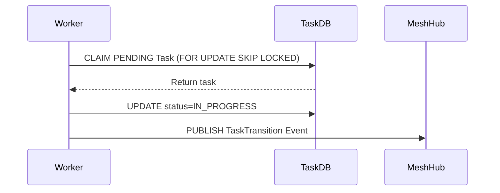

# Title: KAIROS: Phase 1 - Implement Shared Task List Database

## Problem Statement
The Swarm lacks a robust, collision-free mechanism to decompose complex features into a DAG.

## Research Report
The KAIROS Master Plan mandates a distributed state machine using PostgreSQL `FOR UPDATE SKIP LOCKED` for Cloud and local SQLite for Standalone Mode to track `shared_tasks`.

## Design Doc
Create the `shared_tasks` DB schema handling PENDING, IN_PROGRESS, COMPLETED statuses. Ensure `dependencies` is a JSONB array for DAG tracking.

### Task Claiming Sequence

## Implementation Prompt
Hello Implementer agent! Implement the Shared Task List database schema in `srcs/server/db/migrations/` using Goose. Create a table `shared_tasks` with columns: id, organization_id, title, description, status, agent_id, priority, payload, parent_plan_id, dependencies (JSONB), created_at, updated_at. Then implement the task claiming mechanism in `srcs/server/orchestration/tasks_db.go`.

## Priority
P0

## Estimated Scope
Medium

