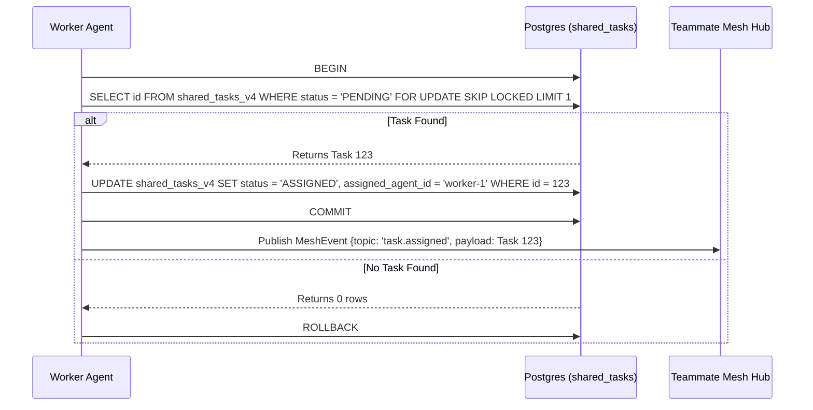

# KAIROS Orchestration: Phase 1 - Shared Task List

**Problem Statement:**
The OHC swarm currently lacks a centralized, distributed system for agents to securely coordinate, decompose, and track task execution across the hybrid architecture. Without a "Shared Task List" leveraging our Postgres backend and Redis Pub/Sub (Teammate Mesh), agents cannot effectively orchestrate complex, multi-step workflows.

**Research Report:**
- Based on `KAIROS_AI_OS_MASTER_PLAN.md` and `kairos_hybrid_os_design.md`, KAIROS must orchestrate the agent team by decomposing high-level feature requests.
- The `shared_tasks_v4` table needs to be created, utilizing `FOR UPDATE SKIP LOCKED` for task claiming to ensure robust concurrency control in Postgres.
- The state machine must track nodes in a Directed Acyclic Graph (DAG) using a JSONB `dependencies` array.

**Design Doc:**
- **Database Schema (`shared_tasks_v4`):**
  - Columns: `id` (UUID), `organization_id` (VARCHAR), `title` (VARCHAR), `description` (TEXT), `status` (VARCHAR), `agent_id` (VARCHAR), `priority` (VARCHAR), `payload` (JSONB), `parent_plan_id` (TEXT), `dependencies` (JSONB).
- **Concurrency:** Ensure that task claiming in Cloud Mode uses `FOR UPDATE SKIP LOCKED`. For Standalone Mode (SQLite), implement an application-level mutex fallback if necessary.
- **Tenant Isolation:** Enforce `organization_id` based tenant isolation correctly.

**Sequence Diagram:**

**Implementation Prompt:**
- **Role:** Implementer
- **Target Files:**
  - Create database migration files in `srcs/server/db/migrations/` (e.g., `0000XX_shared_tasks_v4.up.sql` and `.down.sql`).
  - Implement repository layer logic in `srcs/server/repository/` (e.g., `task_repo.go`).
  - Modify `srcs/server/orchestration/` to integrate with the new schema where necessary.
- **Action Items:**
  1. Write the `UP` and `DOWN` Goose migration files for `shared_tasks_v4`.
  2. Implement the `TaskRepository` interface and its Postgres/SQLite implementations in Go.
  3. Ensure that the `ClaimTask` method uses `SELECT ... FOR UPDATE SKIP LOCKED` (for Postgres).
  4. Ensure all cross-tenant access is correctly fenced by `auth.OrganizationIDFromContext(ctx)`.
  5. Run tests (`bazelisk test //srcs/server/...`) and resolve any issues.

**Priority:** P0
**Estimated Scope:** Large

