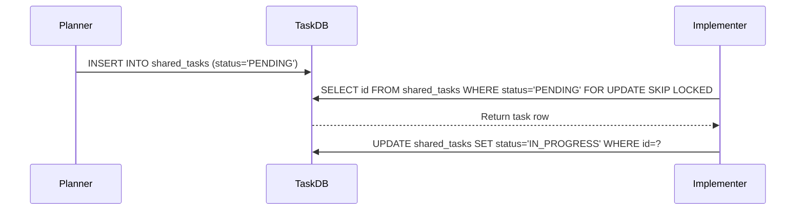

<div markdown="1" style="backdrop-filter: blur(20px) saturate(200%); font-family: 'Outfit', 'Inter', sans-serif; background: rgba(255, 255, 255, 0.03);">

# Mission: KAIROS Shared Task List (Decomposition) Database Schema
## Problem Statement
We need to track complex feature decomposition into actionable, sequenced `shared_tasks`. The current system lacks a unified Postgres schema and sequence diagram to coordinate task delegation between the Planner and Implementer agents in a concurrent environment.

## Research Report
Based on OHC-HA Cloud-Native Mode (PostgreSQL, Redis) optimizations, the orchestration system must support multi-tenant K8s environments with strict tenant isolation. Task processing requires row-level locking (`FOR UPDATE SKIP LOCKED`) to ensure thread/pod safety, preventing race conditions across pods. `shared_tasks` needs an `organization_id` for isolation.

## Design Doc
**Database Schema (PostgreSQL):**
```sql
CREATE TABLE IF NOT EXISTS shared_tasks (
    id UUID PRIMARY KEY DEFAULT gen_random_uuid(),
    organization_id VARCHAR NOT NULL,
    title VARCHAR NOT NULL,
    description TEXT,
    status VARCHAR NOT NULL DEFAULT 'PENDING',
    agent_id VARCHAR,
    priority VARCHAR NOT NULL DEFAULT 'P2',
    payload JSONB
);
```

**Sequence Diagram:**


## Implementation Prompt
Create the Postgres database migration file for the `shared_tasks` table.
1. Add a new sequentially numbered SQL file in `srcs/server/db/migrations/` containing the schema above.
2. Implement the `AcquireTask` function in `srcs/server/orchestration/tasks_db.go` utilizing `FOR UPDATE SKIP LOCKED`.
3. Add a unit test to verify task acquisition in `srcs/server/orchestration/tasks_db_test.go`. Ensure it runs correctly with Bazel.

## Priority
P0
## Estimated Scope
Medium
</div>
