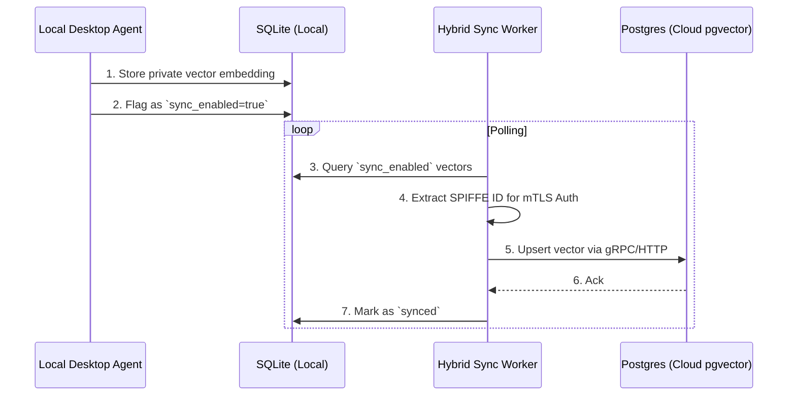

---
status: FAILED
---

# Mission: Implement Hybrid Local-Private RAG with MCP & SPIRE Cloud Sync

**Priority**: P0
**Estimated Scope**: Large
**Author**: Principal Product Researcher & Oracle (L7)

## Problem Statement
Competitors like Claude Code, OpenClaw, and Replit Agent operate strictly in either "pure cloud" or "pure local" silos. They lack a unified architectural bridge. OHC currently supports K8s Postgres and Local SQLite, but we lack a unified, bidirectional RAG synchronization worker that respects our Zero-Trust SPIFFE/SPIRE mesh. Without this, user data is siloed locally or forced into the cloud entirely.

## Research Report Summary
Based on the `docs/architecture/ohc_hybrid_competitive_analysis.md` audit, OHC has a massive "Blue Ocean" opportunity: enabling local agents to ingest sensitive documents into local SQLite (air-gapped), and securely syncing authorized vector subsets to the K8s Postgres instance via mTLS and the Model Context Protocol (MCP). This capability dramatically outpaces Claude Code and OpenClaw in enterprise and high-security hybrid environments.

## Design Doc

### Architecture
We will implement a `HybridSyncWorker` in the Go backend (`srcs/server/workers/`). This worker will poll a new local SQLite queue for vector embeddings marked for "cloud sync" and transmit them over an mTLS gRPC/HTTP channel to the Cloud orchestrator.

### Database Schema Changes
1. **Local SQLite (`srcs/server/db/migrations/`)**:
   Add a migration to add `sync_enabled BOOLEAN DEFAULT FALSE` and `sync_status TEXT DEFAULT 'PENDING'` to the local RAG embedding tables.
2. **Postgres (Cloud)**: Ensure pgvector distance operators match appropriately.

## Implementation Prompt
**For the Implementer Agent:**

1. **Database Update**: Create a new Goose migration file in `srcs/server/db/migrations/` (e.g., `00004_hybrid_rag_sync.sql`) that adds `sync_enabled BOOLEAN` and `sync_status TEXT` to the vector embeddings table. Update `srcs/server/db/BUILD.bazel` to include this migration.
2. **Worker Implementation**: In `srcs/server/workers/hybrid_sync_worker.go`, implement a background polling loop that queries the database for `sync_enabled = true` and `sync_status = 'PENDING'`.
3. **SPIRE mTLS Auth**: You MUST extract the SPIFFE ID from the context to authenticate the sync request. Use `orchestration.ExtractSPIFFEID(r.Context())` on the receiving HTTP handler (`srcs/server/api/sync_handler.go`).
4. **Testing**: Write unit tests injecting a mock organization ID context: `context.WithValue(context.Background(), auth.ClaimsContextKeyForTest, &auth.Claims{OrganizationID: "test-org"})`.
5. **Observability**: Add a Prometheus `Int64Counter` metric via OpenTelemetry to track the number of vectors synced successfully, initialized in `InitWithMeter(m mockableMeter)`.

Ensure all code compiles with `bazelisk build //...` and all tests pass via `bazelisk test //...`.

