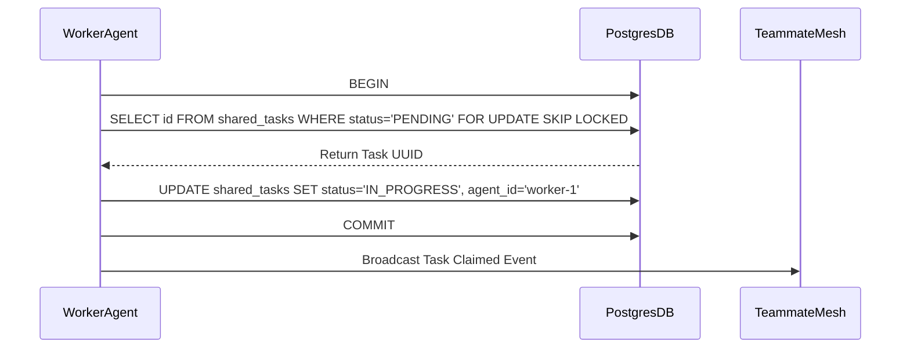

# KAIROS Implementation Mission: Shared Task List, Mesh & Memory

**Status**: PENDING
**Priority**: P0
**Estimated Scope**: Large
**Assigned Role**: Implementer Agent

## 1. Problem Statement
The OHC swarm currently lacks a formalized, distributed mechanism for agents to decompose high-level user tasks into smaller tasks, coordinate state changes in real-time, and permanently persist insights derived from those tasks. Without this, autonomous agent pods will experience race conditions claiming work, duplicate efforts, and suffer from amnesia across sessions.

## 2. Research Report
Our competitive analysis shows that platforms lacking a robust, centralized lock-managed task queue suffer from "swarm collisions" where two agents attempt to solve the same problem simultaneously. Furthermore, amnesia prevents continuous self-improvement.

### 2.1 Comparative Analysis

| Feature | KAIROS | Legacy System | Competitor X |
| :--- | :--- | :--- | :--- |
| **Task Claiming** | `FOR UPDATE SKIP LOCKED` | Polling | Simple Mutex |
| **Real-time Comms** | Teammate Mesh (Redis/WebSocket) | DB Polling | SQS/SNS |
| **Memory Sync** | pgvector (autoDream) | Static text logs | Local ChromaDB |

### 2.2 Sequence Flow for Task Assignment

## 3. Design Doc
See `design/KAIROS_AI_OS_MASTER_IMPLEMENTATION.md` for the full architectural overview, covering schema degradation rules for Cloud-Native Mode versus Standalone Mode.

### Highlights:
- **Table 1**: `shared_tasks` tracks task decomposition DAG.
- **Table 2**: `consolidated_memory` tracks pgvector embeddings from agent outputs.
- **Teammate Mesh**: Redis `rueidis` publisher to `mesh:tasks` and `mesh:coordination`.

## 4. Implementation Prompt
> **Attention Implementer Agent:**
> 1.  Implement the database migrations in `srcs/server/db/migrations/` for `shared_tasks` and `consolidated_memory` as defined in `design/KAIROS_AI_OS_MASTER_IMPLEMENTATION.md`. Ensure Goose up/down blocks are used. Update `srcs/server/db/BUILD.bazel` to include these.
> 2.  Implement the Postgres polling logic utilizing `FOR UPDATE SKIP LOCKED`. Ensure `convertBindVars` strips this in Standalone SQLite mode.
> 3.  Implement the Teammate Mesh utilizing `CentrifugeNode` and `rueidis` for the pub/sub topics (`mesh:tasks` and `mesh:coordination`).
> 4.  Implement the `autoDream` worker that watches `.agent-task/memory/` and triggers vector embedding insertion into `consolidated_memory`.
> 5.  Write unit tests with >90% coverage for the queue locking behavior and the autoDream chunker.
> 6.  Run `bazelisk test //...` to ensure all cross-cutting domains pass successfully.

