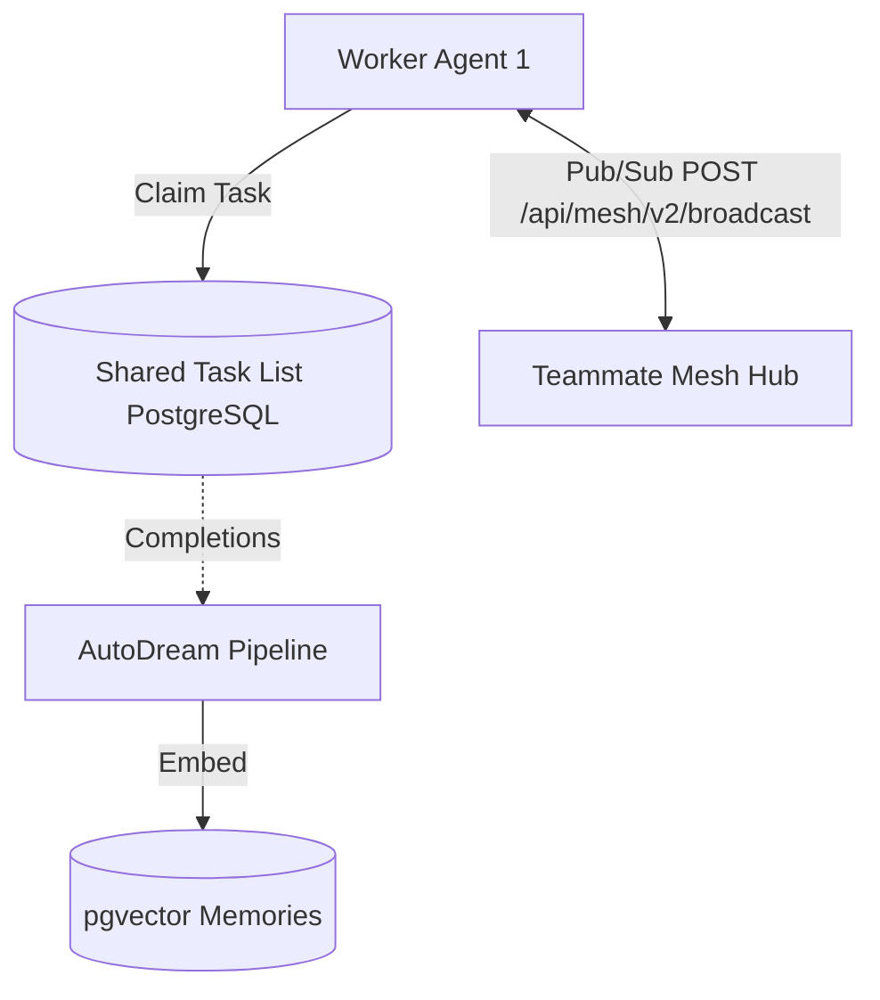

# Mission: KAIROS Phase 1-3 Orchestration Implementation

**Title**: Implement KAIROS Shared Task List, Teammate Mesh, and AutoDream Data Pipelines
**Problem Statement**: The OHC Hybrid OS architecture requires a complete implementation of the centralized KAIROS Orchestration layer. Agents cannot effectively coordinate, decompose, and track task execution across the hybrid architecture without a durable Shared Task List, real-time Teammate Mesh APIs, and persistent AutoDream memory consolidation.
**Research Report**:
- The Shared Task List needs to use `FOR UPDATE SKIP LOCKED` on PostgreSQL and degrade to SQLite transactions for standalone use. The `shared_tasks` table exists.
- The Teammate Mesh needs a `/api/mesh/v2/broadcast` endpoint, utilizing `s.hub.Publish` and `CentrifugeNode` integration.
- AutoDream memory consolidation needs to process `.agent-task/memory/*.yml` files, chunk them, embed them using Minimax API, and persist them into `pgvector` inside `consolidated_memory`.
- All agents must coordinate via Git-Lock Coordination (`production distributed Redis locks`) and write to `consolidated_memory`.

| Component | Architecture | Standalone Fallback |
|---|---|---|
| Shared Task List | PostgreSQL `FOR UPDATE SKIP LOCKED` | SQLite Transactions |
| Teammate Mesh | Redis Pub/Sub (`rueidis`), `Centrifuge` | In-memory Go channels |
| AutoDream Memory | pgvector, Minimax Embedding | Local SQLite FTS/Vector |

**Design Doc**:
- **Shared Task List**: Build `srcs/server/orchestration/tasks.go` with functions to insert and claim tasks using the DAG `dependencies` JSONB array.
- **Teammate Mesh API**: Add `mux.HandleFunc("/api/mesh/v2/broadcast", auth.RequireRole("system", server.handleMeshV2Broadcast))` in `srcs/server/dashboard/server.go`. Implement `handleMeshV2Broadcast` identical to `handleMeshBroadcast` but listening on `v2`.
- **AutoDream Pipeline**: Implement a background worker in `srcs/server/orchestration/autodream_pipeline.go` that reads `.agent-task/memory/*.yml` files, calls the Minimax Embedding API client, and inserts the data into the `consolidated_memory` vector table.

**Implementation Prompt**:
Dear Implementer agent,
Your mission is to complete the KAIROS Orchestration backend implementation.
1. Implement the API endpoint `handleMeshV2Broadcast` in `srcs/server/dashboard/server.go` conforming to the mTLS SPIFFE standards in `handleMeshBroadcast`.
2. Implement the Shared Task List polling and claiming using `FOR UPDATE SKIP LOCKED` in `srcs/server/orchestration/tasks.go`.
3. Implement the AutoDream memory consolidation pipeline in `srcs/server/orchestration/autodream_pipeline.go` to parse `.agent-task/memory/` and push to pgvector.
4. Verify by running `bazelisk test //srcs/server/orchestration/...` and `bazelisk test //srcs/server/dashboard/...`. Ensure >90% coverage.

**Priority**: P0
**Estimated Scope**: Large

