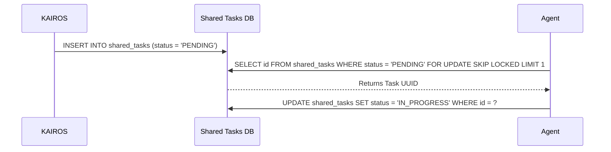

<div markdown="1" style="backdrop-filter: blur(20px) saturate(200%); font-family: 'Outfit', 'Inter', sans-serif; background: rgba(255, 255, 255, 0.03);">

# Title: KAIROS: Phase 1 - Shared Task List Architecture

**Problem Statement:**
The OHC Swarm lacks a central, distributed mechanism for decomposing complex feature requests into actionable, sequenced tasks. Without a reliable task dependency tracker, agents risk race conditions and duplicate execution, preventing absolute autonomy.

**Research Report:**
Analysis of highly concurrent architectures indicates that database-backed state machines are optimal. In a Cloud-Native PostgreSQL environment, a DAG (Directed Acyclic Graph) driven schema utilizing `FOR UPDATE SKIP LOCKED` eliminates worker collisions during task claiming. For Standalone Mode, SQLite transactions gracefully degrade the lock contention without breaking the contract.

**Design Doc:**
**Database Schema (PostgreSQL):**
```sql
CREATE TABLE IF NOT EXISTS shared_tasks (
    id UUID PRIMARY KEY DEFAULT gen_random_uuid(),
    organization_id VARCHAR NOT NULL,
    title VARCHAR NOT NULL,
    description TEXT,
    status VARCHAR NOT NULL DEFAULT 'PENDING',
    agent_id VARCHAR,
    priority VARCHAR NOT NULL DEFAULT 'P2',
    dependencies JSONB NOT NULL DEFAULT '[]',
    created_at TIMESTAMP WITH TIME ZONE DEFAULT CURRENT_TIMESTAMP,
    updated_at TIMESTAMP WITH TIME ZONE DEFAULT CURRENT_TIMESTAMP
);
```

**Sequence Diagram:**


**Implementation Prompt:**
Implement the `shared_tasks` feature.
1. Create the `shared_tasks` table migration in `srcs/server/db/migrations/`.
2. Implement the Go data model and repository for task tracking, utilizing `FOR UPDATE SKIP LOCKED` logic for Postgres.
3. Ensure unit tests cover DAG dependency resolution and status transitions.

**Priority:** P0

**Estimated Scope:** Medium

</div>
