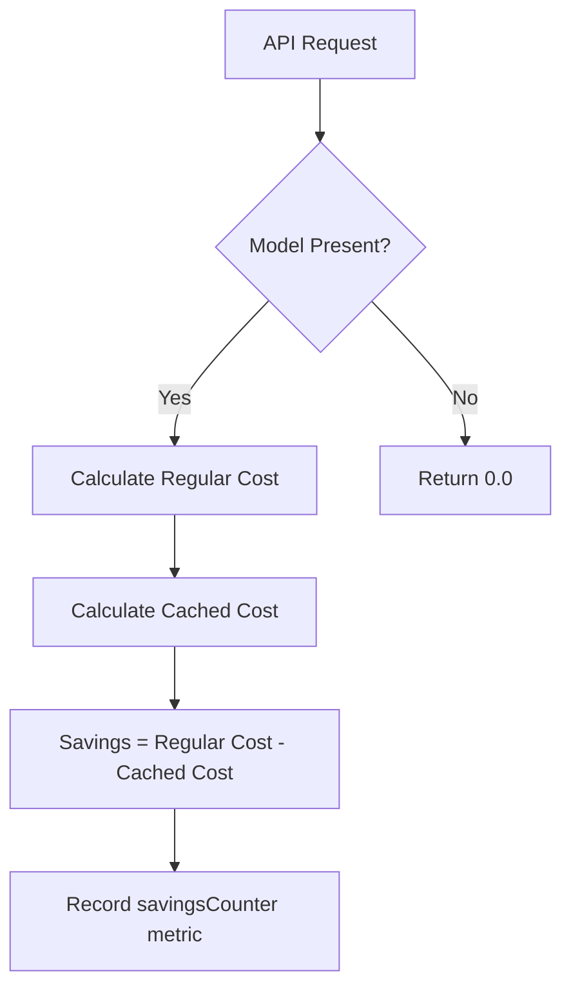

# Title: 💰 Miser: [new cost feature] Savings Calculator and Model Additions

## Problem Statement
The current cost calculator tracks the total cost but does not explicitly quantify the financial savings achieved through our prompt caching mechanisms. Additionally, several popular models like Claude 3 Haiku and Opus are missing.

## Research Report
- `lib/pricing/calculator.go` computes cost but not savings.
- By calculating savings, we can expose metrics on how much our caching architecture is actually reducing cloud costs.

### Current vs Proposed Models Comparison
| Model | Current Status | Input Rate | Output Rate | Cached Rate |
|---|---|---|---|---|
| `claude-3-5-sonnet-20240620` | Present | $3.00 | $15.00 | $0.30 |
| `gpt-4o` | Present | $5.00 | $15.00 | $2.50 |
| `gpt-4o-mini` | Present | $0.15 | $0.60 | $0.075 |
| `claude-3-haiku-20240307` | Missing | $0.25 | $1.25 | $0.025 |
| `claude-3-opus-20240229` | Missing | $15.00 | $75.00 | $1.50 |

### Savings Calculation Architecture

## Design Doc
1. Add `claude-3-haiku-20240307` and `claude-3-opus-20240229` to `ModelPricing`.
2. Add `CalculateSavings` function returning `(InputRate - CachedRate) * cachedTokens`.
3. Add `savingsCounter` metric.

## Implementation Prompt
- Implemented proactively.

## Priority
P1

## Estimated Scope
Small

