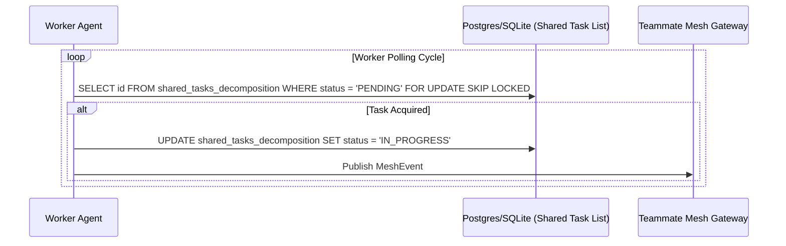

<div markdown="1" style="backdrop-filter: blur(20px) saturate(200%); background: rgba(255, 255, 255, 0.03); font-family: 'Outfit', 'Inter', sans-serif; padding: 2rem; border-radius: 12px; border: 1px solid rgba(255, 255, 255, 0.1);">

# Mission: Implement KAIROS Shared Task List (Phase 1)

**Title**: Implement Shared Task List & Distributed State Machine

**Problem Statement**: The OHC Agent OS lacks a distributed, deadlock-free system to orchestrate and track human feature requests as they are decomposed into actionable tasks across a Swarm.

**Research Report**:
The `docs/architecture/kairos_task_decomposition_design.md` details the required database schema `shared_tasks_decomposition`. To support OHC-HA (Hybrid Architecture), the implementation must use PostgreSQL's `FOR UPDATE SKIP LOCKED` for Cloud-Native multi-tenant concurrency, and degrade gracefully to SQLite mutexes for Desktop Standalone Mode.

**Design Doc**:
The core schema must track the DAG of tasks:
```sql
CREATE TABLE IF NOT EXISTS shared_tasks_decomposition (
    id UUID PRIMARY KEY DEFAULT gen_random_uuid(),
    organization_id VARCHAR NOT NULL,
    title VARCHAR NOT NULL,
    description TEXT,
    status VARCHAR NOT NULL DEFAULT 'PENDING',
    assigned_agent_id VARCHAR,
    priority VARCHAR NOT NULL DEFAULT 'P2',
    payload JSONB,
    parent_plan_id TEXT,
    dependencies JSONB NOT NULL DEFAULT '[]',
    locked_until TIMESTAMP,
    created_at TIMESTAMPTZ DEFAULT CURRENT_TIMESTAMP,
    updated_at TIMESTAMPTZ DEFAULT CURRENT_TIMESTAMP
);
```



**Implementation Prompt**:
Implementer Agent:
1. Create the database migration file in `srcs/server/db/migrations/` for `shared_tasks_decomposition`. Use `TIMESTAMPTZ`. Update `srcs/server/db/BUILD.bazel` to include it.
2. Create the Go model `SharedTaskDecomposition` in `srcs/server/orchestration/models.go` using `time.Time` for timestamps.
3. Implement `TaskStore` interface with methods for acquiring locks. Ensure PostgreSQL uses `FOR UPDATE SKIP LOCKED` and SQLite falls back correctly.
4. Create tests in `srcs/server/orchestration/task_store_test.go`.

**Priority**: P0
**Estimated Scope**: Large

</div>
