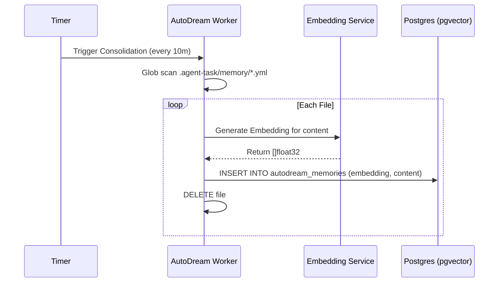

<div markdown="1" style="backdrop-filter: blur(20px) saturate(200%); background: rgba(255, 255, 255, 0.03); font-family: 'Outfit', 'Inter', sans-serif; padding: 2rem; border-radius: 12px; border: 1px solid rgba(255, 255, 255, 0.1);">

# Problem Statement
Under the Swarm Intelligence Protocol (OHC-SIP), temporary scratchpad files and task executions left in `.agent-task/memory/` and `.agent-task/status/` must be consolidated into a long-term Vector database. Currently, these files accumulate endlessly, and agents cannot efficiently query past experiences.

# Research Report
PostgreSQL's `pgvector` extension provides an ideal native vector database solution for our Cloud mode. For local SQLite mode, we can store embeddings as binary blobs. We must extract YAML files, invoke an LLM for embeddings via our existing `srcs/server/agents/local/llm.go` abstraction, and persist them to `autodream_memories`. We also need to add PostgreSQL-specific vector functionality with fallback logic in `srcs/server/db/database.go`.

# Design Doc
### AutoDream Pipeline Architecture


### Database Schema Definition
```sql
CREATE TABLE IF NOT EXISTS autodream_memories (
    id UUID PRIMARY KEY DEFAULT gen_random_uuid(),
    task_id UUID REFERENCES shared_tasks_decomposition(id),
    content TEXT NOT NULL,
    embedding vector(1536),
    created_at TIMESTAMPTZ DEFAULT CURRENT_TIMESTAMP
);
```

# Implementation Prompt
Hello Implementer Agent! Please execute Phase 3 of KAIROS Orchestration:
1.  **Migrations**: Write migration `055_autodream_memories_pgvector.sql` mapping to the above schema. Update `srcs/server/db/BUILD.bazel`.
2.  **Database Compatibility**: Ensure `srcs/server/db/database.go` is updated to replace Postgres specific `vector(1536)` with SQLite compatible blob equivalents.
3.  **Pipeline Logic**: Build the background worker in `srcs/server/orchestration/autodream.go`. Implement a routine that uses `filepath.Glob` to locate `*.yml` files in `.agent-task/memory/`, passes their string content to `llm.Embed()`, saves the results to the database via `Hub.SIPDB()`, and deletes the processed file to ensure Zero WIP.
4.  **Testing**: Construct an in-memory test suite verifying the parsing, database insertion, and deletion flow using `sqlite://:memory:`.

</div>
