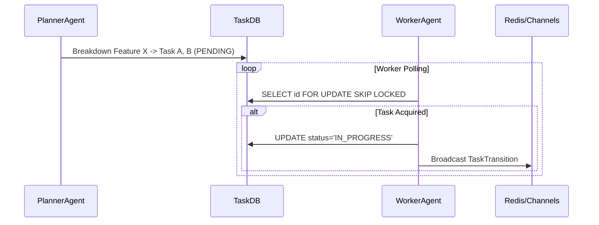

<div markdown="1" style="backdrop-filter: blur(20px) saturate(200%); background: rgba(255, 255, 255, 0.03); font-family: 'Outfit', 'Inter', sans-serif; padding: 2rem; border-radius: 12px; border: 1px solid rgba(255, 255, 255, 0.1);">

# Problem Statement
The OHC AI OS currently lacks a comprehensive, distributed backend system capable of decomposing complex, multi-step feature requests into granular executable units (a "Shared Task List") while safely coordinating access amongst a swarm of autonomous worker agents without race conditions.

# Research Report
Architectural requirements demand hybrid compatibility: KAIROS must orchestrate across Cloud-Native deployments using PostgreSQL (`SKIP LOCKED` strategies for multi-tenancy and high throughput) and Standalone desktop deployments using SQLite (relying on explicit transactions and mutex locks). Background processing and vector consolidation must pipe completed tasks into `pgvector` memory structures via `AutoDream`.

# Design Doc
We introduce the `shared_tasks_decomposition` database entity, functioning as a distributed state machine:
```sql
CREATE TABLE IF NOT EXISTS shared_tasks_decomposition (
    id UUID PRIMARY KEY DEFAULT gen_random_uuid(),
    organization_id VARCHAR NOT NULL,
    title VARCHAR NOT NULL,
    description TEXT,
    status VARCHAR NOT NULL DEFAULT 'PENDING',
    assigned_agent_id VARCHAR,
    priority VARCHAR NOT NULL DEFAULT 'P2',
    payload JSONB,
    parent_plan_id TEXT,
    dependencies JSONB NOT NULL DEFAULT '[]',
    locked_until TIMESTAMP,
    created_at TIMESTAMPTZ DEFAULT CURRENT_TIMESTAMP,
    updated_at TIMESTAMPTZ DEFAULT CURRENT_TIMESTAMP
);
```

### Orchestration Sequence Diagram (Teammate Mesh via Hub)


# Implementation Prompt
Hello Implementer Agent! Please execute Phase 1 of the KAIROS Orchestration master plan:
1.  **Migrations**: Create `054_kairos_shared_tasks_decomposition.sql` within `srcs/server/db/migrations/` implementing the SQL schema provided in the Design Doc. Ensure you update `srcs/server/db/BUILD.bazel` to include this new migration file.
2.  **Models**: Construct the equivalent Go model `SharedTaskDecomposition` in `srcs/server/orchestration/models.go` using `time.Time` exclusively for `CreatedAt` and `UpdatedAt`.
3.  **Interfaces**: Architect the `TaskStore` repository interface within `srcs/server/orchestration/` containing `ClaimTask(ctx)` and `TransitionTask(ctx)`. Ensure `ClaimTask` utilizes Postgres `SKIP LOCKED` behavior or SQLite Mutex fallback depending on driver.
4.  **Testing**: Build out 100% coverage unit tests in `srcs/server/orchestration/task_store_test.go` confirming safe concurrent claiming.

</div>
