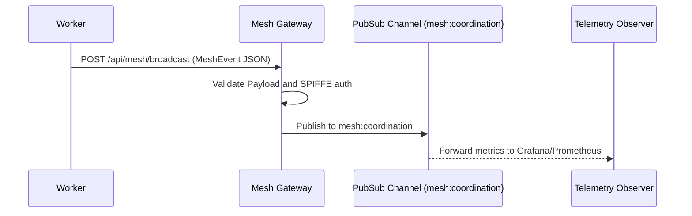

<div markdown="1" style="backdrop-filter: blur(20px) saturate(200%); background: rgba(255, 255, 255, 0.03); font-family: 'Outfit', 'Inter', sans-serif; padding: 2rem; border-radius: 12px; border: 1px solid rgba(255, 255, 255, 0.1);">

# Problem Statement
For the Swarm Intelligence Protocol (OHC-SIP) to operate efficiently, sub-agents must coordinate their activities and share internal state transitions synchronously in realtime across the distributed OHC platform. Currently, no generalized Realtime Teammate Mesh API exists.

# Research Report
KAIROS demands a highly available transport layer. Using Redis Pub/Sub via `rueidis` scales efficiently for the `OHC_MULTITENANT=true` Cloud configuration. For the local Standalone mode, graceful degradation via in-memory Go channels is necessary. All payloads must adhere to a standardized `MeshEvent` contract containing caller identity, action type, and status flags.

# Design Doc
### MeshEvent Contract Definition
```json
{
  "event_id": "uuid",
  "agent_id": "string (SPIFFE ID)",
  "action": "TaskTransition | SystemAlert | Heartbeat",
  "status": "string",
  "payload": {},
  "timestamp": "ISO-8601"
}
```

### Architectural Flow (Teammate Mesh)


# Implementation Prompt
Hello Implementer Agent! Please execute Phase 2 of KAIROS Orchestration:
1.  **API Gateway**: Implement `POST /api/mesh/broadcast` in `srcs/server/orchestration/mesh/server.go`. Ensure it securely authenticates via SPIFFE middleware.
2.  **Payload Validation**: Construct the `MeshEvent` struct mapping to the documented JSON contract and enforce strict payload validation upon ingest.
3.  **Transport Logic**: Build the interface `MeshBroadcaster`. Under Cloud-Native (`OHC_MULTITENANT=true`), wire this to Redis Pub/Sub using `rueidis`. For Standalone Mode, back it with a Go Channel dispatcher.
4.  **Observability**: Integrate OpenTelemetry counters (`m.Int64Counter()`) inside the handler to track `mesh_broadcast_events_total`. Update `BUILD.bazel` to include telemetry dependencies.

</div>
