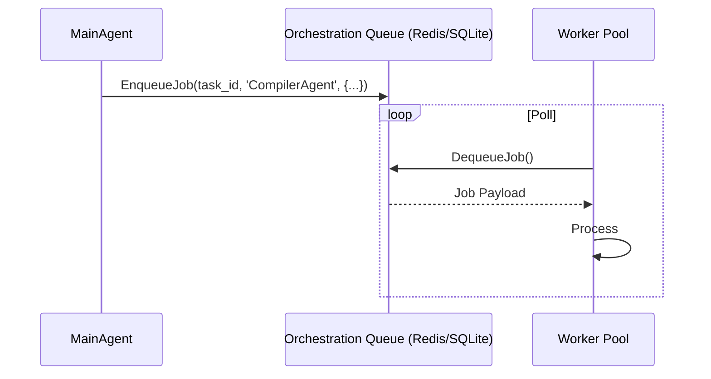

<div markdown="1" style="backdrop-filter: blur(20px) saturate(200%); background: rgba(255, 255, 255, 0.03); font-family: 'Outfit', 'Inter', sans-serif; padding: 2rem; border-radius: 12px; border: 1px solid rgba(255, 255, 255, 0.1);">

# Problem Statement
Large complex features cannot be resolved sequentially by a single agent. The KAIROS master plan requires a distributed job queue to dispatch asynchronous background sub-agent workers capable of consuming payloads generated by Phase 1's shared task decomposition.

# Research Report
A traditional messaging queue pattern is required here. Cloud deployments should lean on Redis sorted sets (ZSETs) for priority queueing to enable massive horizontal scalability of agent Pods. Standalone local execution must fallback to SQLite tables for reliability.

# Design Doc
### Queue Schema Definition
```sql
CREATE TABLE IF NOT EXISTS sub_agent_jobs (
    id UUID PRIMARY KEY DEFAULT gen_random_uuid(),
    task_id UUID REFERENCES shared_tasks_decomposition(id),
    worker_class VARCHAR NOT NULL,
    payload JSONB,
    status VARCHAR NOT NULL DEFAULT 'QUEUED',
    run_at TIMESTAMPTZ DEFAULT CURRENT_TIMESTAMP,
    created_at TIMESTAMPTZ DEFAULT CURRENT_TIMESTAMP,
    updated_at TIMESTAMPTZ DEFAULT CURRENT_TIMESTAMP
);
```

### Queue Dispatch Sequence Diagram


# Implementation Prompt
Hello Implementer Agent! Please execute Phase 4 of KAIROS Orchestration:
1.  **Migrations**: Draft `056_sub_agent_jobs_queue.sql` in `srcs/server/db/migrations/` using the specified schema. Update `srcs/server/db/BUILD.bazel`.
2.  **Core Interface**: Create `srcs/server/orchestration/queue/queue.go`. Define the `SubAgentQueue` interface containing `EnqueueJob` and `DequeueJob`.
3.  **Hybrid Engines**: Develop two implementations of this interface: `RedisQueue` mapped to ZSET structures and `SQLiteQueue` mapping to the newly created DB tables.
4.  **Testing**: Build out 100% test coverage using mock redis instances and SQLite memory databases to guarantee the priority dequeue logic functions deterministically.

</div>
