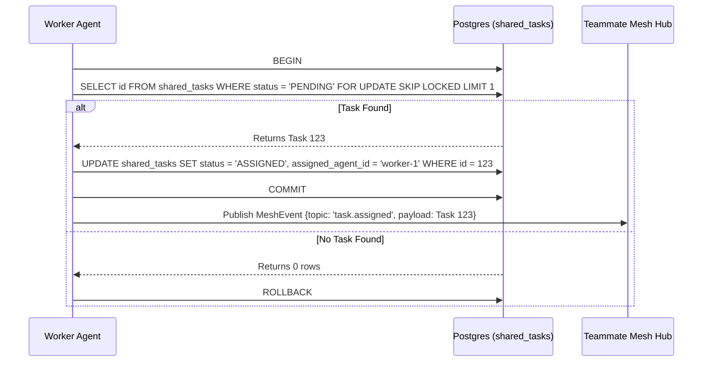

# KAIROS Orchestrator: Hybrid Agentic OS Architecture

<div style="backdrop-filter: blur(20px) saturate(200%); background: rgba(255, 255, 255, 0.03); border: 1px solid rgba(255,255,255,0.1); border-radius: 12px; padding: 20px; font-family: 'Outfit', 'Inter', sans-serif;">
## The Swarm Intelligence Vision
One Human Corp (OHC) empowers a single human to orchestrate a vast swarm of AI agents. The KAIROS Hybrid Architecture ensures a frictionless and beautiful experience.
</div>

## Problem Statement
The OHC Hybrid Agentic OS requires a resilient, distributed, and aesthetically premium infrastructure to coordinate a vast swarm of AI agents across multiple operating modes (Cloud-Native Multi-Tenant and Desktop Standalone). The system must gracefully handle distributed state machine tracking, real-time agent synchronization, and long-term memory consolidation without compromising the visual excellence mandate. Current systems lack a unified shared task list orchestrator with corresponding realtime teammate mesh APIs and vector-backed memory consolidation.

## Research Report
1. **Competitor Analysis:**
   - **Claude Code:** Static, isolated single-user CLI.
   - **Replit Agent:** Cloud-only, limited autonomy beyond simple code generation.
2. **OHC Unfair Advantage:**
   - Hybrid operational mode: local SQLite + Go channels (standalone) vs. distributed PostgreSQL + Redis Pub/Sub (cloud).
   - "Glassmorphism" Visual Excellence Mandate directly integrated into the orchestration tools.
3. **Architecture Deep Dive:**
   - **Phase 1: Shared Task List:** Needs a distributed state machine (PostgreSQL `FOR UPDATE SKIP LOCKED` / SQLite fallback).
   - **Phase 2: Teammate Mesh:** Needs a unified transport interface (`MeshTransport`) routing to Redis or memory depending on deployment.
   - **Phase 3: AutoDream:** Needs a background vector indexing job (`pgvector`) to summarize ephemeral agent memory into durable insights.

## Design Doc

### 1. Database Schema
```sql
-- PostgreSQL (Cloud-Native Mode)
CREATE TABLE IF NOT EXISTS shared_tasks (
    id UUID PRIMARY KEY DEFAULT gen_random_uuid(),
    organization_id VARCHAR NOT NULL,
    title VARCHAR NOT NULL,
    status VARCHAR NOT NULL DEFAULT 'PENDING',
    dependencies JSONB,
    payload JSONB
);

-- SQLite Fallback (Standalone Desktop Mode)
CREATE TABLE IF NOT EXISTS shared_tasks (
    id TEXT PRIMARY KEY,
    organization_id TEXT NOT NULL,
    title TEXT NOT NULL,
    status TEXT NOT NULL DEFAULT 'PENDING',
    dependencies TEXT,
    payload TEXT
);
```

### 2. Teammate Mesh APIs (Orchestration)
Implement a `MeshTransport` interface in `srcs/server/mesh/mesh.go`:
```go
type MeshTransport interface {
    Publish(ctx context.Context, channel string, payload []byte) error
    Subscribe(ctx context.Context, channel string, handler func([]byte)) error
}
```
Provide two implementations: `RedisMeshTransport` and `MemoryMeshTransport`.

### 3. AutoDream Data Pipelines (Memory)
Implement `AutoDreamWorker` in `srcs/server/autodream/worker.go` to pull from `.agent-task/memory/` and embed using Minimax/OpenAI, storing into `autodream_memories`.

### 4. Aesthetic Core
Any UI rendering these tasks must strictly apply:
- `backdrop-filter: blur(20px) saturate(200%)`
- `background: rgba(255, 255, 255, 0.03)`
- `font-family: 'Outfit', 'Inter', sans-serif`

### 5. Sequence Diagram


## Implementation Prompt
**Implementer Name:** Implementer (Lead Palette L7)
**Task:** Implement Phase 1, Phase 2, and Phase 3 of KAIROS Orchestration.

**Instructions:**
1. Create `srcs/server/db/migrations/[NEXT_AVAILABLE]_shared_tasks.sql` with the `shared_tasks` table definitions for PostgreSQL and SQLite. Ensure `[NEXT_AVAILABLE]` is dynamically replaced with the next logical sequential number for migrations in `srcs/server/db/migrations/`.
2. In `srcs/server/mesh/mesh.go` (create if needed), define the `MeshTransport` interface with `Publish` and `Subscribe`.
3. In `srcs/server/autodream/worker.go` (create if needed), scaffold the `AutoDreamWorker` struct with a `ConsolidateMemories()` method.
4. Update `srcs/server/db/provider.go` to add a `GetSharedTask()` method to the `Provider` interface.
5. Provide tests in `srcs/server/mesh/mesh_test.go` and `srcs/server/autodream/worker_test.go`. Ensure >90% test coverage.

**Priority:** P0
**Estimated Scope:** Large
