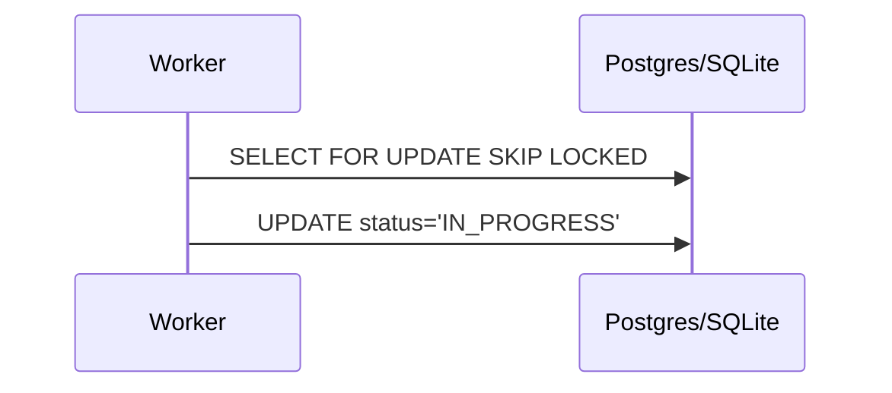

<div markdown="1" style="backdrop-filter: blur(20px) saturate(200%); background: rgba(255, 255, 255, 0.03); font-family: 'Outfit', 'Inter', sans-serif;">

# Design Doc
### Orchestration Flow


### Schema
```sql
CREATE TABLE IF NOT EXISTS shared_tasks_decomposition (
    id UUID PRIMARY KEY DEFAULT gen_random_uuid(),
    organization_id VARCHAR NOT NULL,
    title VARCHAR NOT NULL,
    status VARCHAR NOT NULL DEFAULT 'PENDING',
    priority VARCHAR NOT NULL DEFAULT 'P2',
    dependencies JSONB NOT NULL DEFAULT '[]'
);
```

# Implementation Prompt
Hello Implementer, execute Phase 1:
1. Migration: Add `[NEXT_AVAILABLE]_kairos_shared_tasks_decomposition.sql`.
2. Model: Go struct `SharedTaskDecomposition` in `srcs/server/orchestration/models.go`.
3. Repo: Create `TaskStore` with `ClaimTask` using driver-specific locking.
</div>
