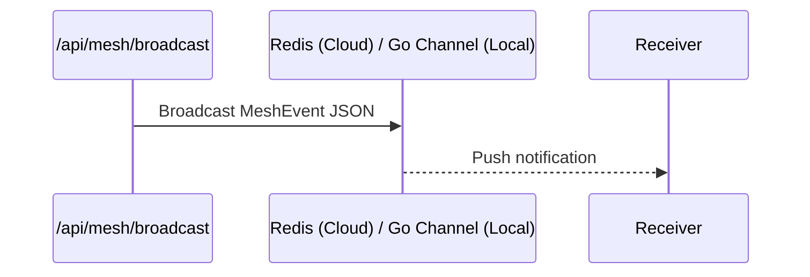

# Design Doc
### Mesh Architecture

### Event Contract
Based on `srcs/proto/hub.proto` `MeshEvent`:
Must include `agent_id`, `action`, and `status`.

# Implementation Prompt
Hello Implementer, execute Phase 2:
1. Endpoint: Implement `POST /api/mesh/broadcast` in `srcs/server/orchestration/mesh/server.go`.
2. Validation: Validate incoming JSON against the `MeshEvent` structure.
3. Transport Hook: Call `BroadcastMeshEvent` logic leveraging `rueidis` for Redis deployments and channel logic for standalone.

