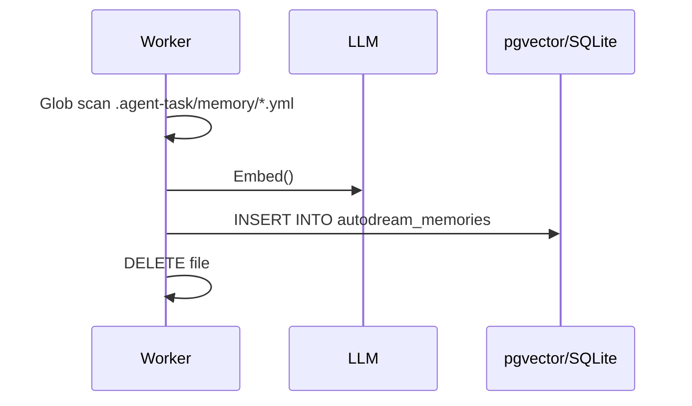

<div markdown="1" style="backdrop-filter: blur(20px) saturate(200%); background: rgba(255, 255, 255, 0.03); font-family: 'Outfit', 'Inter', sans-serif;">

# Design Doc
### AutoDream Pipeline


### Schema Definition
```sql
CREATE TABLE IF NOT EXISTS autodream_memories (
    id UUID PRIMARY KEY DEFAULT gen_random_uuid(),
    task_id UUID REFERENCES shared_tasks_decomposition(id),
    content TEXT NOT NULL,
    embedding vector(1536),
    created_at TIMESTAMP WITH TIME ZONE DEFAULT CURRENT_TIMESTAMP
);
```

# Implementation Prompt
Hello Implementer, execute Phase 3:
1. Migration: Add `[NEXT_AVAILABLE]_autodream_memories_pgvector.sql` matching the schema.
2. Worker Logic: In `srcs/server/orchestration/autodream.go`, parse `.agent-task/memory/`, embed with `llm.Embed()`, and store in Vector DB.
3. Cleanup: Ensure file deletion upon success.
</div>
