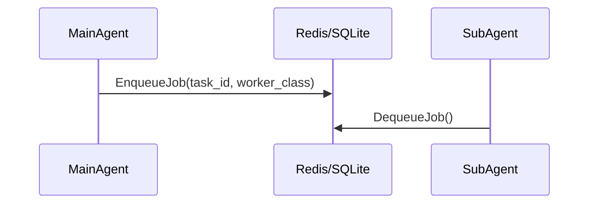

<div markdown="1" style="backdrop-filter: blur(20px) saturate(200%); background: rgba(255, 255, 255, 0.03); font-family: 'Outfit', 'Inter', sans-serif;">

# Design Doc
### Queue Architecture


### Schema Definition
```sql
CREATE TABLE IF NOT EXISTS sub_agent_jobs (
    id UUID PRIMARY KEY DEFAULT gen_random_uuid(),
    task_id UUID REFERENCES shared_tasks_decomposition(id),
    worker_class VARCHAR NOT NULL,
    payload JSONB,
    status VARCHAR NOT NULL DEFAULT 'QUEUED',
    run_at TIMESTAMP WITH TIME ZONE DEFAULT CURRENT_TIMESTAMP,
    created_at TIMESTAMP WITH TIME ZONE DEFAULT CURRENT_TIMESTAMP,
    updated_at TIMESTAMP WITH TIME ZONE DEFAULT CURRENT_TIMESTAMP
);
```

# Implementation Prompt
Hello Implementer, execute Phase 4:
1. Migration: Add `[NEXT_AVAILABLE]_sub_agent_jobs_queue.sql`.
2. Interface: Create `SubAgentQueue` interface in `srcs/server/orchestration/queue/queue.go` with `EnqueueJob` and `DequeueJob`.
3. Drivers: Build `RedisQueue` and `SQLiteQueue` matching the specification.
</div>
