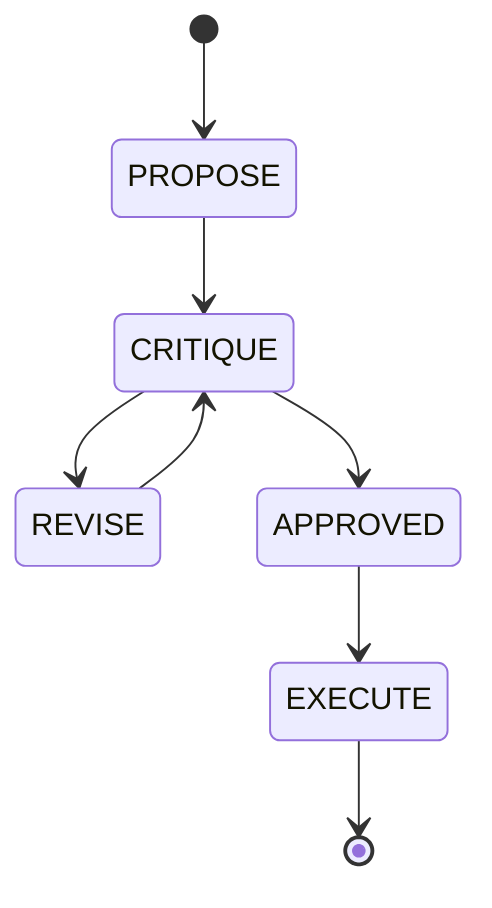

# Design Doc
### UltraPlan Flow

### Integration Points
- **State Machine:** Track phase transitions in a `ultraplan_deliberations` DB schema.
- **Mesh:** Broadcast events on the `mesh:ultraplan` channel.
- **Queue:** Sub-Agents must participate in the critique and review loops.

# Implementation Prompt
Hello Implementer, execute the UltraPlan Architecture:
1. Migration: Add `[NEXT_AVAILABLE]_ultraplan_deliberations.sql`.
2. Core Logic: Implement the state machine transitions in `srcs/server/orchestration/ultraplan.go`.
3. Transport: Connect state transitions to broadcast on `mesh:ultraplan` via Teammate Mesh.

