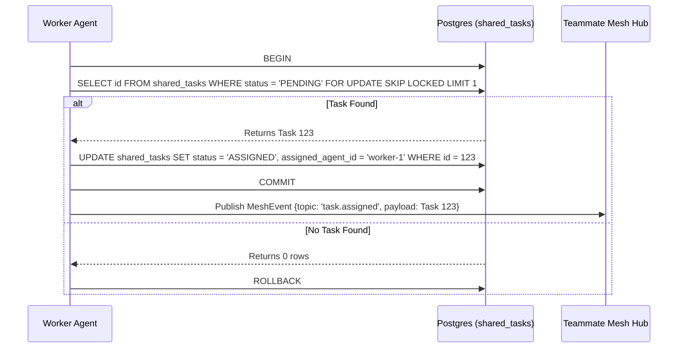

# Title: KAIROS Master Orchestration Interfaces

## Problem Statement
The KAIROS orchestrator is required to decompose high-level feature requests into a shared task list for the agent team. The OHC swarm requires a distributed Shared Task List, a realtime Teammate Mesh, an AutoDream vector memory pipeline, and a Sub-Agent Queue for true autonomous orchestration in both cloud-native and standalone deployments. We need to formalize these interfaces for sub-agents.

## Research Report
The existing designs and plans need to be consolidated and built into concrete backend API interfaces and database schemas. The swarm relies on database locks (`FOR UPDATE SKIP LOCKED`) in PostgreSQL and `sync.Mutex`/explicit transactions in SQLite for safe parallel task execution. The messaging layer must enforce OHC-SIP payload compliance.

## Design Doc
<div markdown="1" style="backdrop-filter: blur(20px) saturate(200%); background: rgba(255, 255, 255, 0.03); font-family: 'Outfit', 'Inter', sans-serif;">

# OHC KAIROS Orchestration: Shared Task List & Teammate Mesh

## 1. Phase 1: Shared Task List Decomposition

The Shared Task List relies on database-backed state machines to prevent race conditions during task claiming.

### Database Schema (PostgreSQL):
```sql
CREATE TABLE IF NOT EXISTS shared_tasks (
    id UUID PRIMARY KEY DEFAULT gen_random_uuid(),
    organization_id VARCHAR NOT NULL,
    title VARCHAR NOT NULL,
    description TEXT,
    status VARCHAR NOT NULL DEFAULT 'PENDING',
    agent_id VARCHAR,
    priority VARCHAR NOT NULL DEFAULT 'P2',
    payload JSONB,
    parent_plan_id TEXT,
    dependencies JSONB NOT NULL DEFAULT '[]',
    locked_until TIMESTAMP,
    created_at TIMESTAMP WITH TIME ZONE DEFAULT CURRENT_TIMESTAMP,
    updated_at TIMESTAMP WITH TIME ZONE DEFAULT CURRENT_TIMESTAMP
);
```

### Shared Task Claiming Workflow


## 2. Phase 2: Teammate Mesh APIs

The Teammate Mesh ensures agents coordinate without delays.

- **Endpoint:** `POST /api/mesh/v2/broadcast`
  Broadcasts a state machine event over structured channels.

```json
{
  "channel": "mesh:tasks",
  "event_type": "TASK_TRANSITION",
  "data": {
    "task_id": "task_12345",
    "previous_state": "PENDING",
    "new_state": "IN_PROGRESS"
  }
}
```
</div>

## Implementation Prompt
Hello Implementer agent!

Your mission is to implement the KAIROS Orchestrator feature set.

1. **Shared Task List**: Add a new SQL migration in the database migrations directory creating a `shared_tasks` table based on the schema in the Design Doc. Implement Go code to interact with this table in the orchestration directory. Ensure Postgres uses `SKIP LOCKED` and SQLite uses `sync.Mutex`. Add the migration to the appropriate database build file. Write corresponding unit tests.
2. **Teammate Mesh API**: Implement a `POST /api/mesh/broadcast` endpoint in the API mesh directory. The payload must enforce JSON validation for mesh events. Wrap the handler with proper system validation and auth middlewares. Update tests.
3. **AutoDream Pipeline**: Implement a background worker in the orchestration directory to scan memory yaml files, embed them, and consolidate into long term storage tables.
4. **Sub-Agent Queue**: Implement an enqueue/dequeue interface in the orchestration queue directory. In cloud environments use Redis, in Standalone back it with SQLite.
