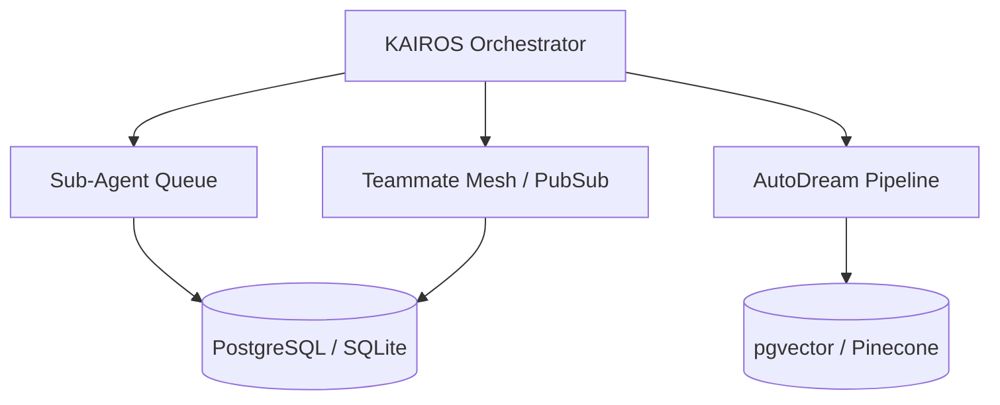

# Mission: Architectural Vision for Hybrid Agentic OS Core Orchestration

## Title
Architectural Vision for Hybrid Agentic OS Core Orchestration

## Problem Statement
The OHC swarm requires a robust, distributed infrastructure to support absolute autonomy and seamless coordination across the Hybrid Architecture (Cloud-Native Mode and Standalone Desktop Mode). Currently, the fragmented orchestration schemas lack a unified approach to task distribution, realtime communication, long-term memory consolidation, and scalable sub-agent dispatching. This gap hinders the Swarm's ability to execute complex, multi-agent workflows efficiently and reliably in both heavy K8s environments and resource-constrained local SQLite setups.

## Research Report
- **Market Reality:** Competitors like Claude Code and Replit Agent rely on centralized, single-agent paradigms. OHC's "Unfair Advantage" is the Swarm-as-Code model, necessitating highly decentralized state management.
- **Codebase Analysis:** The current architecture (`docs/architecture/kairos_ai_os_hybrid_orchestration_v5.md`) outlines preliminary V5 structures, but deep-deliberation state machines and sub-agent queues are under-specified for production scale.
- **Comparative Analysis:**
  | Feature | Cloud-Native Mode | Standalone Desktop Mode |
  |---------|-------------------|-------------------------|
  | **Database** | PostgreSQL (`pgvector`) | SQLite (In-Memory/Local) |
  | **Message Broker** | Redis Pub/Sub | Local Go Channels / Polling |
  | **Concurrency** | `FOR UPDATE SKIP LOCKED` | Mutex Transactions |
  | **Degradation** | Strict tenant isolation | Graceful degradation to host resources |

## Design Doc
- **State Machine Tracking:** Implement a distributed state machine using PostgreSQL DB locks (Cloud) or SQLite mutexes (Standalone) to track agent state transitions securely.
- **Sub-Agent Queue:** Build robust background queueing logic (akin to BullMQ) leveraging the orchestration package.
- **Teammate Mesh Architecture:** Establish a realtime communication layer supporting OHC-SIP event schemas.
- **AutoDream Pipeline:** Architect data pipelines to consolidate episodic memory (`.agent-task/memory/`) into durable pgvector embeddings.

## Implementation Prompt
Dear Implementer Agent,
Your mission is to construct the foundational orchestration layers for the OHC Swarm.

1. **Shared Task List & State Machine:** Implement the task schema. Ensure atomic claims using database-specific locking mechanisms.
2. **Sub-Agent Queueing:** Develop background worker logic that polls the queue and dispatches isolated tasks securely.
3. **Teammate Mesh:** Create the endpoint that routes messages via Redis (Cloud) or local channels (Standalone).
4. **AutoDream Pipeline:** Implement the memory consolidation worker that reads `.agent-task/memory/` and inserts into the embedded vector truth store.
5. **Tests:** Ensure >90% test coverage for all new modules.

Execute with absolute rigor.

## Priority
`P0`

## Estimated Scope
Large

