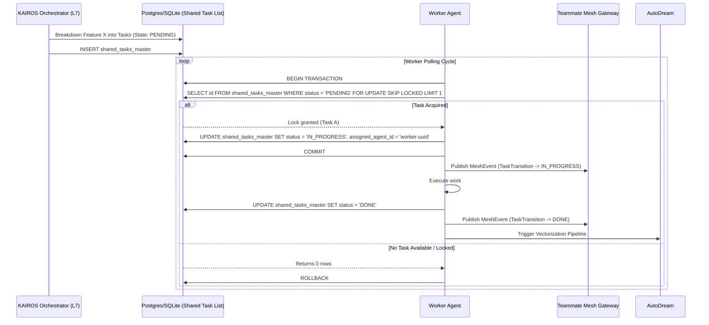

# Title: Shared Task List, Teammate Mesh, and AutoDream Implementation

## Problem Statement
The OHC Hybrid Agentic OS requires the foundational implementation of the KAIROS Orchestration engine. Specifically, we must implement the unified Shared Task List, Realtime Teammate Mesh APIs, and AutoDream memory pipelines to enable horizontal scaling and standalone graceful degradation.

## Research Report
Based on the KAIROS Hybrid Agentic OS Master Blueprint, we need a robust integration of task decomposition and execution. This relies on a Distributed State Machine backed by PostgreSQL (`FOR UPDATE SKIP LOCKED`) in cloud mode and SQLite in standalone mode. Furthermore, realtime coordination demands WebSockets or Server-Sent Events (SSE) backed by Redis Pub/Sub. Finally, to ensure long-term swarm intelligence, we must deploy the AutoDream pipeline leveraging `pgvector` for memory consolidation upon task completion.

## Design Doc

<div markdown="1" style="backdrop-filter: blur(20px) saturate(200%); background: rgba(255, 255, 255, 0.03); font-family: 'Outfit', 'Inter', sans-serif; border: 1px solid rgba(255, 255, 255, 0.1); padding: 20px; border-radius: 12px; color: #fff;">

### 1. Phase 1: Shared Task List (Decomposition)

The core component is the database-backed Shared Task state machine, ensuring safe, deadlock-free orchestration.

#### 1.1 Database Schema Definition (PostgreSQL)

```sql
CREATE TABLE IF NOT EXISTS shared_tasks_master (
    id UUID PRIMARY KEY DEFAULT gen_random_uuid(),
    organization_id VARCHAR NOT NULL,
    title VARCHAR NOT NULL,
    description TEXT,
    status VARCHAR NOT NULL DEFAULT 'PENDING',
    assigned_agent_id VARCHAR,
    priority VARCHAR NOT NULL DEFAULT 'P2',
    payload JSONB,
    parent_plan_id TEXT,
    dependencies JSONB NOT NULL DEFAULT '[]',
    locked_until TIMESTAMP,
    created_at TIMESTAMP WITH TIME ZONE DEFAULT CURRENT_TIMESTAMP,
    updated_at TIMESTAMP WITH TIME ZONE DEFAULT CURRENT_TIMESTAMP
);
```

#### 1.2 Shared Task Execution Sequence



### 2. Phase 2: Realtime Teammate Mesh APIs

The Teammate Mesh facilitates communication and coordination between agents executing tasks.

#### 2.1 API Contracts

- **POST `/api/mesh/broadcast`**
  - **Payload:** `{ "agent_id": "uuid", "task_id": "uuid", "event_type": "status_update", "data": {} }`
  - **Behavior:** Broadcasts the event to the appropriate Redis Pub/Sub channel based on the organization or task group.

- **GET `/api/mesh/stream`**
  - **Behavior:** Establishes an SSE or WebSocket connection to stream realtime events to UIs or observer agents. Relies on SPIFFE/SPIRE for zero-trust authentication.

#### 2.2 Redis Coordination
In Cloud Mode, the mesh leverages Redis Pub/Sub (`PUBLISH mesh_events payload`). In Standalone Mode, it degrades gracefully to in-memory channels (e.g., Go `chan`).

### 3. Phase 3: AutoDream Data Pipeline

The AutoDream pipeline converts completed tasks and agent experiences into long-term memories.

#### 3.1 Vector Database Schema (`pgvector`)

```sql
CREATE TABLE IF NOT EXISTS autodream_memories_master (
    id UUID PRIMARY KEY DEFAULT gen_random_uuid(),
    task_id UUID REFERENCES shared_tasks_master(id),
    agent_id VARCHAR NOT NULL,
    memory_type VARCHAR NOT NULL,
    content TEXT NOT NULL,
    embedding vector(1536),
    created_at TIMESTAMP WITH TIME ZONE DEFAULT CURRENT_TIMESTAMP
);
```

#### 3.2 Embedding Architecture
When a task transitions to `DONE`, an async worker picks up the task payload, calls the LLM embedding API (e.g., OpenAI `text-embedding-3-small`), and inserts the result into `autodream_memories_master`.

</div>

## Implementation Prompt
Hello Implementer. You are to implement the KAIROS core systems based on the verified architecture.
1. **Phase 1**: Add a new migration to `srcs/server/db/migrations/` that defines the `shared_tasks_master` table. Update `srcs/server/db/BUILD.bazel` to include the new migration. Add the struct representing the table to `srcs/server/orchestration/tasks.go` or equivalent. Implement the `FOR UPDATE SKIP LOCKED` polling logic.
2. **Phase 2**: Add the routing logic in `srcs/server/api/mesh/mesh.go` integrating with Redis Pub/Sub (and in-memory fallback) to expose `/api/mesh/broadcast` and `/api/mesh/stream` endpoints.
3. **Phase 3**: Add an SQL migration for `autodream_memories_master` utilizing `pgvector` in `srcs/server/db/migrations/`. Ensure task completion events synchronously or asynchronously invoke the vectorization pipeline in `srcs/server/orchestration/autodream.go`.
4. Ensure robust tests are added for any new components and that you use SPIFFE/SPIRE context.

## Priority
P0

## Estimated Scope
Large
