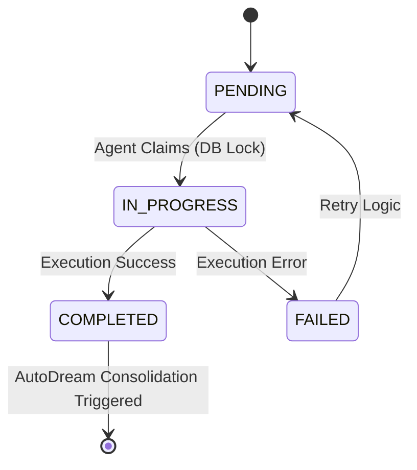
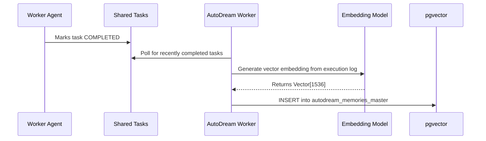

# Title: OHC Swarm Shared Task List, Teammate Mesh, and AutoDream Architectural Implementation Details

## Problem Statement
The KAIROS Orchestrator lacks unified architectural documentation for its core components: the Shared Task List (task decomposition and state tracking), the Teammate Mesh (real-time cross-agent communication), and AutoDream (long-term vector memory consolidation). While disjointed mission briefs exist, a comprehensive "Gold Standard" design document and corresponding visual artifacts are needed in the central repository (`docs/architecture/` and `design/`) to ensure consistent implementation across hybrid environments (cloud-native and standalone). Furthermore, specific implementation details concerning the database schemas and API contracts need to be centralized.

## Research Report
Current implementation efforts are guided by fragmented mission files (e.g., `2026-04-15T16-00-00Z.md`, `2026-04-15T06-20-50Z.md`, `2026-04-15T12-30-00Z.md`).
- **Shared Task List**: Uses PostgreSQL with `FOR UPDATE SKIP LOCKED` for cloud concurrency, and SQLite with explicit transactions for local standalone execution. Tracks states (`PENDING`, `IN_PROGRESS`, `DONE`, `COMPLETED`) in a centralized database schema (`shared_tasks_master` / `shared_tasks_decomposition`).
- **Teammate Mesh**: A real-time transport layer. Uses Redis Pub/Sub in multi-tenant environments and in-memory Go channels for standalone operations. Handles standard mesh events like `TaskClaimedEvent` and `TaskCompletedEvent`. API endpoints include `POST /api/mesh/broadcast` and `GET /api/mesh/stream`.
- **AutoDream**: The memory consolidation pipeline. Uses `pgvector` (`autodream_memories_master` / `autodream_memories`) to store embeddings generated from completed tasks and their execution logs. Triggered when `shared_tasks_master` status transitions to `COMPLETED`.

Consolidating these components into a central master blueprint (`docs/architecture/kairos_hybrid_agentic_os_master_blueprint.md`) and a unified system diagram (`design/kairos_orchestrator_diagram.md`) is necessary to meet OHC's high aesthetic and architectural standards. This document provides the concrete designs that Implementer agents will use.

## Design Doc
<div markdown="1" style="backdrop-filter: blur(20px) saturate(200%); font-family: 'Outfit', 'Inter', sans-serif; background: rgba(255, 255, 255, 0.03); color: #fff; padding: 20px; border-radius: 12px; border: 1px solid rgba(255, 255, 255, 0.1);">

# KAIROS AI OS: Hybrid Orchestration Master Blueprint Implementation Details

## 1. Shared Task List Architecture
The task decomposition engine relies on a robust database schema to track state and handle concurrency safely.

*   **Cloud Mode**: PostgreSQL. Uses `FOR UPDATE SKIP LOCKED` to allow horizontal pod autoscaling without deadlocks.
*   **Standalone Mode**: SQLite. Uses isolated application-level transactions and mutexes.

### 1.1 Database Schema (PostgreSQL & SQLite Compatible)
```sql
CREATE TABLE IF NOT EXISTS shared_tasks_master (
    id VARCHAR PRIMARY KEY,
    organization_id VARCHAR NOT NULL,
    title VARCHAR NOT NULL,
    description TEXT,
    status VARCHAR NOT NULL DEFAULT 'PENDING',
    priority VARCHAR NOT NULL DEFAULT 'P2',
    payload JSONB,
    assigned_agent_id VARCHAR,
    dependencies JSONB NOT NULL DEFAULT '[]',
    created_at TIMESTAMP WITH TIME ZONE DEFAULT CURRENT_TIMESTAMP,
    updated_at TIMESTAMP WITH TIME ZONE DEFAULT CURRENT_TIMESTAMP
);

CREATE TABLE IF NOT EXISTS task_dependencies_master (
    task_id VARCHAR NOT NULL,
    depends_on_task_id VARCHAR NOT NULL,
    PRIMARY KEY (task_id, depends_on_task_id)
);
```

### 1.2 State Machine Flow
Tasks transition through `PENDING` -> `IN_PROGRESS` -> `COMPLETED` or `FAILED`.



## 2. Realtime Teammate Mesh
To synchronize state without aggressive polling, KAIROS leverages a push-based Teammate Mesh API.

*   **Cloud Backend**: Redis Pub/Sub channels (e.g., `mesh:coordination`, `mesh:tasks`).
*   **Standalone Backend**: Go Memory Channels (`sync.RWMutex`).

### 2.1 API Contracts
- `POST /api/mesh/broadcast`: Publish a task state transition or capability event to the swarm.
- `GET /api/mesh/stream`: Subscribe to realtime teammate events (SSE/WebSocket).

## 3. AutoDream Vector Pipeline
To combat "Agent Amnesia," the AutoDream background worker acts upon `COMPLETED` tasks. It retrieves payload logs, utilizes an LLM (e.g., Minimax, OpenAI) to summarize context, and stores high-dimensional embeddings (1536) in `pgvector`. This establishes the Swarm Intelligence Protocol (OHC-SIP).

### 3.1 Durable Vector Storage Schema
```sql
CREATE TABLE IF NOT EXISTS autodream_memories_master (
    id UUID PRIMARY KEY DEFAULT gen_random_uuid(),
    entity_id VARCHAR,
    entity_type VARCHAR,
    content TEXT NOT NULL,
    embedding vector(1536),
    created_at TIMESTAMP WITH TIME ZONE DEFAULT CURRENT_TIMESTAMP
);
```



</div>

## Implementation Prompt
Hello Implementer. Based on the Master Blueprint, you must implement the unified KAIROS orchestration engine:
1. Ensure the `shared_tasks_master` and `autodream_memories_master` migrations exist in `srcs/server/db/migrations/` exactly as defined in the Design Doc.
2. Implement the `FOR UPDATE SKIP LOCKED` logic in the task orchestrator package, operating on `shared_tasks_master`.
3. Implement the Teammate Mesh API routing exposing `POST /api/mesh/broadcast` and `GET /api/mesh/stream`, leveraging the `MeshTransport` interface (Redis / In-Memory).
4. Implement the AutoDream worker that hooks into task `COMPLETED` events, generates embeddings, and stores them in `autodream_memories_master`.
5. Provide strict test coverage using `bazelisk test`.

## Priority
P0

## Estimated Scope
Large
