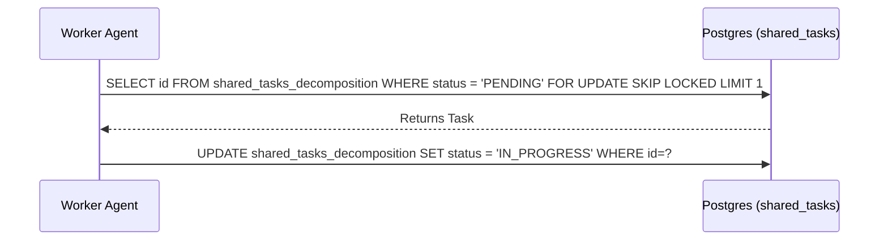

# Title: Implement Shared Task List (Decomposition)

**Problem Statement:**
KAIROS Orchestrator needs to decompose complex feature requests into actionable tasks within a distributed Shared Task List, preventing worker collisions.

**Research Report:**
The Shared Task List relies on database-backed state machines. In Cloud-Native Mode, it uses PostgreSQL with `FOR UPDATE SKIP LOCKED`.

**Design Doc:**
```sql
CREATE TABLE IF NOT EXISTS shared_tasks_decomposition (
    id UUID PRIMARY KEY DEFAULT gen_random_uuid(),
    organization_id VARCHAR NOT NULL,
    title VARCHAR NOT NULL,
    description TEXT,
    status VARCHAR NOT NULL DEFAULT 'PENDING',
    assigned_agent_id VARCHAR,
    priority VARCHAR NOT NULL DEFAULT 'P2',
    payload JSONB,
    parent_plan_id TEXT,
    dependencies JSONB NOT NULL DEFAULT '[]',
    locked_until TIMESTAMP,
    created_at TIMESTAMP WITH TIME ZONE DEFAULT CURRENT_TIMESTAMP,
    updated_at TIMESTAMP WITH TIME ZONE DEFAULT CURRENT_TIMESTAMP
);
```


**Implementation Prompt:**
Hello Implementer. Implement the Shared Task List task claiming workflow using PostgreSQL `FOR UPDATE SKIP LOCKED` and SQLite fallbacks. The schema `shared_tasks_decomposition` is already defined in `srcs/server/db/migrations/054_shared_tasks_decomposition.sql`. Ensure you write relevant Go tests.

**Priority:** P0
**Estimated Scope:** Large
