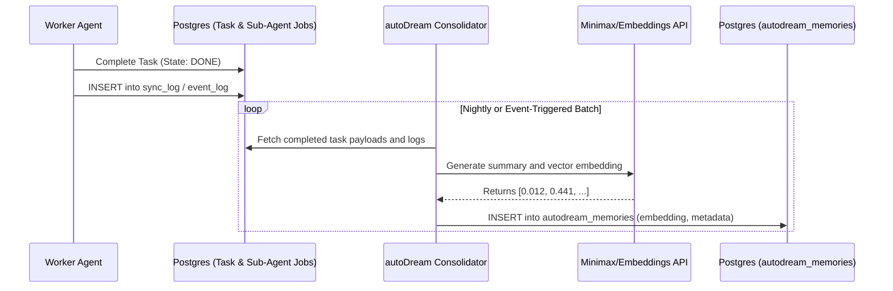

<div markdown="1" style="backdrop-filter: blur(20px) saturate(200%); background: rgba(255, 255, 255, 0.03); font-family: 'Outfit', 'Inter', sans-serif;">

**KAIROS AI OS autoDream Implementation**

**Problem Statement**
The OHC swarm requires a long-term memory consolidation system (autoDream) to compress, embed, and store execution learnings into a durable vector database for cross-agent knowledge sharing.

**Research Report**
autoDream leverages `pgvector` for embedding storage and similarity search in Cloud Mode. The architecture requires a background pipeline to process completed tasks and their outputs into dense vector representations.

**Design Doc**

**KAIROS Orchestration: autoDream Memory Pipeline Design**

**1. Vision**
autoDream is the semantic backbone of the OHC Swarm Intelligence Protocol (OHC-SIP). By continuously consolidating the execution history and outcomes of the Teammate Mesh, autoDream enables future agents to recall past strategies, avoid repeated mistakes, and bootstrap complex tasks using historical context.

**2. Data Architecture (pgvector)**
The core requirement is a highly available vector database optimized for multi-tenant memory retrieval.

**2.1 Database Schema Definition**
We extend our PostgreSQL footprint with `pgvector` specifically designed for our `1536`-dimensional embeddings (e.g., standard OpenAI/Minimax dimensions).

```sql
CREATE EXTENSION IF NOT EXISTS vector;

CREATE TABLE IF NOT EXISTS autodream_memories (
    id TEXT PRIMARY KEY,
    organization_id VARCHAR NOT NULL,
    task_id TEXT REFERENCES shared_tasks_decomposition(id),
    content TEXT NOT NULL,
    embedding vector(1536),
    metadata JSONB,
    created_at TIMESTAMP WITH TIME ZONE DEFAULT CURRENT_TIMESTAMP
);

-- Optimize for cosine distance queries
CREATE INDEX ON autodream_memories USING ivfflat (embedding vector_cosine_ops) WITH (lists = 100);
```

**3. autoDream Consolidation Pipeline**
The memory consolidation runs asynchronously to avoid blocking agent execution.



**Implementation Prompt**
Hello Implementer. You are to implement the KAIROS autoDream memory pipeline.
1. Add a new migration to `srcs/server/db/migrations/20260415123000_autodream_memories_schema.sql` that defines the `autodream_memories` table with the `vector` extension.
2. Update `srcs/server/db/BUILD.bazel` to include the new migration file in the `embedsrcs` list.
3. Create a new service package `srcs/server/orchestration/autodream/` and implement the `Consolidator` pipeline logic outlined in the design doc. It must fetch completed tasks, call the embedding service, and insert records into `autodream_memories`.
4. Ensure robust unit and integration tests are added.

**Priority**
P1

**Estimated Scope**
Medium

</div>
