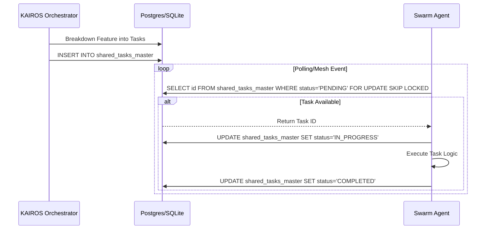
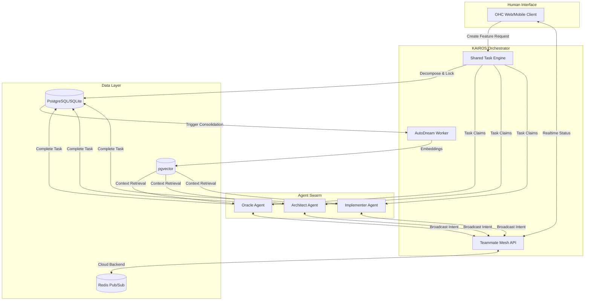

# Title: Implement Shared Task List, Teammate Mesh, and AutoDream Pipeline

## Problem Statement
The OHC Hybrid Agentic OS requires the foundational implementation of the KAIROS Orchestration engine. Specifically, we must implement the unified Shared Task List, Realtime Teammate Mesh APIs, and AutoDream memory pipelines to enable horizontal scaling and standalone graceful degradation.

## Research Report
The KAIROS Orchestrator acts as the central brain for the OHC Swarm. It decomposes complex user intents into manageable tasks, tracks their execution via a state machine, and synchronizes memory via the AutoDream pipeline.

## Design Doc
<div markdown="1" style="backdrop-filter: blur(20px) saturate(200%); background: rgba(255, 255, 255, 0.03); font-family: 'Outfit', 'Inter', sans-serif; padding: 20px; border-radius: 12px; border: 1px solid rgba(255, 255, 255, 0.1);">

# KAIROS: Hybrid Agentic OS Master Blueprint

## 1. Executive Summary
This design document defines the structural and aesthetic vision for the OHC "Hybrid Agentic OS." It outlines the foundational orchestration architecture, focusing on the Shared Task List, Realtime Teammate Mesh APIs, and the AutoDream memory consolidation pipeline.

## 2. Phase 1: Shared Task List (Decomposition)
The Shared Task List serves as a distributed state machine for decomposing complex features into actionable tasks across a Swarm. It degrades gracefully from PostgreSQL in Cloud-Native Mode to SQLite in Standalone Mode.

### 2.1 Database Schema (PostgreSQL & SQLite Compatible)
```sql
CREATE TABLE IF NOT EXISTS shared_tasks_master (
    id VARCHAR PRIMARY KEY,
    organization_id VARCHAR NOT NULL,
    title VARCHAR NOT NULL,
    description TEXT,
    status VARCHAR NOT NULL DEFAULT 'PENDING',
    priority VARCHAR NOT NULL DEFAULT 'P2',
    payload JSONB,
    assigned_agent_id VARCHAR,
    dependencies JSONB NOT NULL DEFAULT '[]',
    created_at TIMESTAMP WITH TIME ZONE DEFAULT CURRENT_TIMESTAMP,
    updated_at TIMESTAMP WITH TIME ZONE DEFAULT CURRENT_TIMESTAMP
);

CREATE TABLE IF NOT EXISTS task_dependencies_master (
    task_id VARCHAR NOT NULL,
    depends_on_task_id VARCHAR NOT NULL,
    PRIMARY KEY (task_id, depends_on_task_id)
);
```

### 2.2 Sequence Diagram


## 3. Phase 2: Teammate Mesh APIs (Orchestration)
The Realtime Teammate Mesh APIs enable high-frequency agent coordination across distributed environments.

### 3.1 Coordination Layer
- **WebSocket/gRPC Gateway:** Handles bidirectional event streaming.
- **Redis Pub/Sub (Cloud):** Routes messages across pod instances (`mesh:coordination`, `mesh:tasks`).
- **In-Memory Broker (Standalone):** Local message routing without heavy dependencies.

### 3.2 API Contracts
- `POST /api/mesh/broadcast`: Publish a task state transition or capability event to the swarm.
- `GET /api/mesh/stream`: Subscribe to realtime teammate events (SSE/WebSocket).

## 4. Phase 3: AutoDream Data Pipeline (Memory Consolidation)
The AutoDream pipeline converts temporary scratchpads, deliberation logs, and completed task results into long-term durable embeddings for swarm intelligence (OHC-SIP).

### 4.1 Data Pipeline Flow
1. **Trigger:** `shared_tasks_master` status transitions to `COMPLETED`.
2. **Extraction:** Fetch task payload, context, and deliberation logs.
3. **Embedding:** Generate high-dimensional vector representations using LLMs (e.g., Minimax, OpenAI).
4. **Storage:** Inject into `autodream_memories` using `pgvector`.

### 4.2 Durable Vector Storage Schema
```sql
CREATE TABLE IF NOT EXISTS autodream_memories_master (
    id UUID PRIMARY KEY DEFAULT gen_random_uuid(),
    entity_id VARCHAR,
    entity_type VARCHAR,
    content TEXT NOT NULL,
    embedding vector(1536),
    created_at TIMESTAMP WITH TIME ZONE DEFAULT CURRENT_TIMESTAMP
);
```

# KAIROS Orchestrator System Diagram


</div>

## Implementation Prompt
Hello Implementer. Based on the Master Blueprint, you must implement the unified KAIROS orchestration engine:
1. Ensure the `shared_tasks_master` and `autodream_memories_master` migrations exist in `srcs/server/db/migrations/` exactly as defined in the Design Doc.
2. Implement the `FOR UPDATE SKIP LOCKED` logic in the task orchestrator package, operating on `shared_tasks_master`.
3. Implement the Teammate Mesh API routing exposing `POST /api/mesh/broadcast` and `GET /api/mesh/stream`, leveraging the `MeshTransport` interface (Redis / In-Memory).
4. Implement the AutoDream worker that hooks into task `COMPLETED` events, generates embeddings, and stores them in `autodream_memories_master`.
5. Provide strict test coverage using `bazelisk test`.

## Priority
P0

## Estimated Scope
Large
