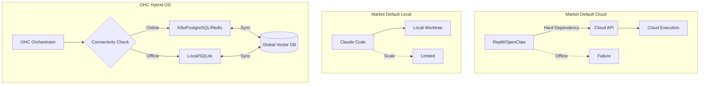

# Competitive Audit: OHC Hybrid Architecture vs. Claude-Class Agents

## Executive Summary
This report analyzes the competitive landscape of Agentic OS platforms, specifically focusing on Claude Code and the lack of Hybrid (Cloud vs. Local) capabilities in rival platforms. It identifies a "Blue Ocean" opportunity for One Human Corp (OHC) to leverage its dual PostgreSQL/SQLite architecture to provide unparalleled isolation and scalability.

## 1. Competitive Landscape Analysis

### Claude Code
- **Strengths:** Robust local subprocess isolation, temporary git worktrees, dynamic permissions, complex error handling.
- **Weaknesses:** Strictly local/single-user execution. Lacks cloud-native horizontal scaling and multi-tenant isolation. No built-in vector synchronization to a central Hub.

### OpenClaw & Replit Agent
- **Strengths:** Excellent cloud-based IDE integration, managed environments, ease of deployment.
- **Weaknesses:** Entirely cloud-dependent. Cannot function in a standalone, disconnected environment (Standalone Desktop Mode). Prone to latency and API rate limits.

### OHC (The Hybrid Advantage)
- **Strengths:** Seamless degradation from Cloud-Native (K8s/PostgreSQL/Redis) to Standalone Desktop (SQLite). Can execute full agentic loops locally without external dependencies (Builtin agent).
- **Weaknesses (Current):** `srcs/server/agents/provider.go` lacks the deep subprocess isolation and worktree sandboxing seen in Claude Code.

## 2. Feature Disruption: "Auto-Degrading Hybrid Execution"
**The Blue Ocean Opportunity:**
Competitors force users to choose between local privacy (Claude Code) and cloud scalability (Replit). OHC's architecture allows for "Auto-Degrading Hybrid Execution".

If a cloud node fails or the user disconnects, OHC can gracefully degrade to its local SQLite/Builtin stack, executing tasks in isolated local sandboxes, and then syncing the vector DB state upon reconnection.

## 3. Visual Architecture: OHC vs Market

### Comparative Table

| Feature | Claude Code | Replit Agent | **OHC Hybrid (Proposed)** |
| :--- | :--- | :--- | :--- |
| Cloud Multi-tenant | ❌ | ✅ | ✅ |
| Local Standalone | ✅ | ❌ | ✅ |
| Isolated Worktrees | ✅ | ❌ | **✅ (Pending Mission)** |
| Vector State Sync | ❌ | ❌ | ✅ |

## 4. Roadmap Blueprinting (Missions Created)
1. **[research] Enhance Agent Harness for OHC using Claude-Class Isolation:** Implement `IsolationStrategy` in `provider.go` to support `RunInIsolation(worktree string)` and pipe output to Redis Pub/Sub. (Mission created in `.agent-task/missions/` and `agent_missions` DB table).

## 5. Conclusion
By implementing the Claude-Class isolation features defined in the mission brief, OHC will neutralize Claude Code's primary advantage while maintaining its superior Hybrid OS architecture, securing market dominance.
