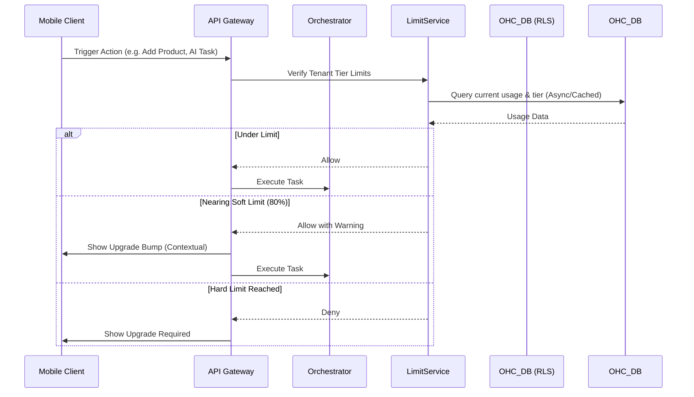

# [architecture] Multi-Tenant SaaS Tier Architecture

## Problem Statement
Small business owners (our personas like Maya, Carlos, Priya) start their journeys with varying needs and budgets. A "one size fits all" pricing model either prices out the beginner or leaves money on the table for established businesses. OHC needs a tier system that allows users to start for free with immediate value (reducing onboarding friction to zero), and progressively scales capabilities (Products, Storage, AI Departments) alongside their revenue growth. The system must enforce these limits seamlessly across the multi-tenant architecture without degrading performance, and present upgrade paths intuitively rather than as roadblocks.

## Research Report
Competitive analysis reveals distinct approaches:
- **Shopify:** Complex tiering ($39 to $399+), high friction onboarding, requires third-party apps for basic functionality.
- **Wix:** Moderate tiering ($16 to $159), feature-gated (e.g., analytics only on higher tiers).
- **Squarespace:** $16 to $49, gates basic commerce features.
- **Durable (AI Builder):** Simple ($12 to $20), but lacks operational depth.

**OHC Positioning:** OHC will offer a genuinely useful Free tier (crucial for "Idea -> Live in 10 mins") and scale based on volume and AI complexity. We differentiate by gating the *number* of autonomous AI Departments and Actions, ensuring the AI scales with the business operations.

## Design Doc

### Tier Matrix

| Tier | Price | Products | AI Departments | AI Actions/mo | Storage | Custom Domain |
|---|---|---|---|---|---|---|
| Free | $0 | 10 | 1 (Operations) | 100 | 500MB | No (OHC subdomain) |
| Starter | $9/mo | 100 | 3 | 1,000 | 5GB | Yes |
| Pro | $29/mo | Unlimited | 10 | Unlimited | 50GB | Yes + SSL |
| Business | $79/mo | Unlimited | Unlimited | Unlimited | 500GB | Yes + multi-domain |

### Architecture Diagram

### Key Design Decisions
1.  **Multi-Tenancy Enforced at DB Level:** All tracking metrics (storage, products, AI actions) must be isolated per tenant using Row Level Security (RLS) in PostgreSQL.
2.  **Hard vs. Soft Limits:** Storage and Products are hard limits. AI actions are soft limits; exceeding them shifts agents to "read-only/draft-only" mode where they advise but do not execute autonomously, preserving trust while encouraging upgrades.
3.  **Contextual "Bumps":** Upgrades are presented in-flow (e.g., when a user uploads their 10th photo, the system praises the progress and offers the next tier).
4.  **No API/Schema Prescriptions:** The specific API routes and database DDL are left to the implementation team to ensure they align with the current Bazel/Go/Rust stack and existing schema migration strategies.

### Mobile UX Flow (375px First)
1.  User reaches 80% of storage limit while adding a product photo.
2.  A glassmorphic, non-blocking toast appears: "Looking great! You're almost out of storage. Upgrade to Starter to add more."
3.  Tapping the toast opens a native bottom sheet (Apple/Google in-app purchase flow) showing a simple comparison table:
    *   Current: Free (500MB)
    *   Next: Starter (5GB) - $9/mo
4.  1-Tap authentication via FaceID/TouchID completes the upgrade.
5.  System immediately unlocks the new limits; user continues uploading without losing state.

## Implementation Prompt

**Objective:** Implement the underlying data models and tracking mechanisms to support the Multi-Tenant SaaS Tier structure described in the architecture document.

**Acceptance Criteria:**
1.  Establish the tier definitions (Free, Starter, Pro, Business) and their corresponding limits (Products, AI Actions, Storage) within the platform's configuration or database.
2.  Ensure every tenant is linked to a specific tier upon registration (defaulting to Free).
3.  Implement robust tracking for monthly AI actions, storage utilization, and product counts per tenant. Ensure this tracking respects multi-tenant RLS boundaries.
4.  Develop a mechanism to verify if a tenant's requested action exceeds their current tier limits. This mechanism should support returning warnings (for soft limits) or errors (for hard limits).
5.  Ensure the verification mechanism does not significantly impact latency on high-frequency endpoints (e.g., consider caching strategies if necessary).
6.  The implementation must NOT prescribe specific API route names or database schemas, but rather provide the core logic and service layer functions.

## Priority
P1 (High)

## Estimated Scope
Medium
