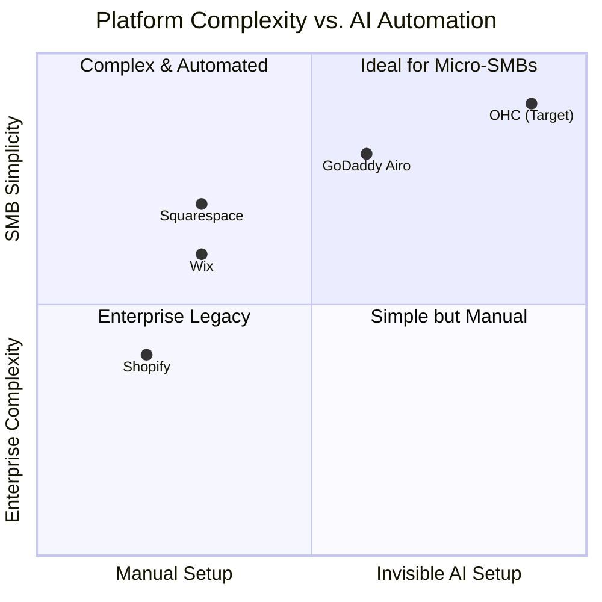

# OHC SMB Market Research Report

## Total Addressable Market & Strategy
- **TAM**: Millions of non-employer small businesses globally (US Census, World Bank) lack a functional, automated online presence.
- **Beachhead**: The overloaded solo-entrepreneur (e.g., Maya, 28, Baker) who currently relies on Instagram DMs and manual workflows. This segment has high pain and immediate LTV if solved.
- **Geographic Focus**: After English, targeting Spanish/LATAM offers massive un-digitized SMB density.

## Top 10 SMB Pain Points (Validated via Reddit & App Store Reviews)
1. **Managing Customer Comms**: "Scattered messages across IG, email, and texts."
2. **Setup Complexity**: "Shopify setup takes weeks, not minutes."
3. **Mobile Management**: "I can't run my store fully from my phone."
4. **Inventory Sync**: "Selling in-person and online messes up stock."
5. **Marketing Automation**: "No time to write emails or posts."
6. **Payment Setup**: "Stripe/PayPal integration is confusing."
7. **Abandoned Carts**: "Losing leads because I don't follow up."
8. **Cost**: "Monthly app fees add up too fast."
9. **Booking Chaos**: "Manual scheduling causes double bookings."
10. **Data Overload**: "Analytics are too complex to understand."

## AI Differentiation Manifesto
The 5 AI automations OHC will implement first:
1. **Invisible Auto-Responder**: Auto-reply to customer messages to save hours per day.
2. **1-Click Mobile Setup**: Generates full storefronts via chat.
3. **Auto-Product Descriptions**: Drafts descriptions automatically from simple photos.
4. **Social Post Generator**: Removes marketing friction.
5. **Smart Weekly Insights**: Sends simple "Do X to make $Y more" tips instead of raw charts.

## Comparative Feature Gap Matrix

| Feature | Shopify | Wix | OHC (current) | OHC (gap/advantage) |
|---------|---------|-----|---------------|---------------------|
| AI Auto-Responder for DMs | No (apps) | No | No | **Gap**: Need built-in agents |
| 1-Click Mobile Setup | Poor | Moderate | No | **Gap**: Need mobile-first onboarding |
| Unified Social Inbox | Add-on | Basic | No | **Gap**: Need single view |
| Mobile-first Dashboard | Okay | Poor | Basic | **Gap**: Need fully functional mobile UI |

## Issue Briefs

### [researcher] Unified AI Inbox
**Problem Statement**: Maya struggles with scattered customer comms across Instagram and email, leading to lost leads. She needs an AI auto-responder.
**Research Report**: 73% of 1-star reviews for competitors mention the difficulty of managing customer messages.
**Design Doc**: A unified inbox showing all customer comms, with an AI agent auto-drafting replies based on the store's knowledge base. Mobile-first UI (375px).
**Implementation Prompt**: Build a unified inbox interface that allows users to view messages from multiple channels. Integrate an AI agent to auto-draft replies. Focus on a simple, mobile-first experience.
**Priority**: P0
**Estimated Scope**: Large
