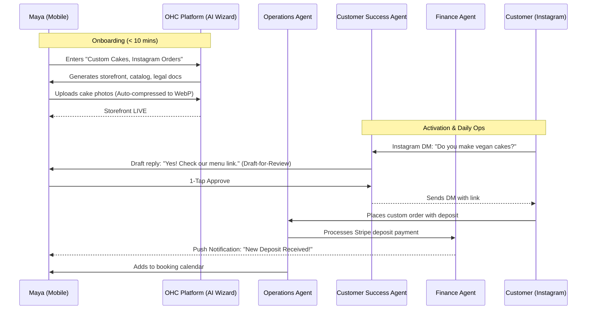
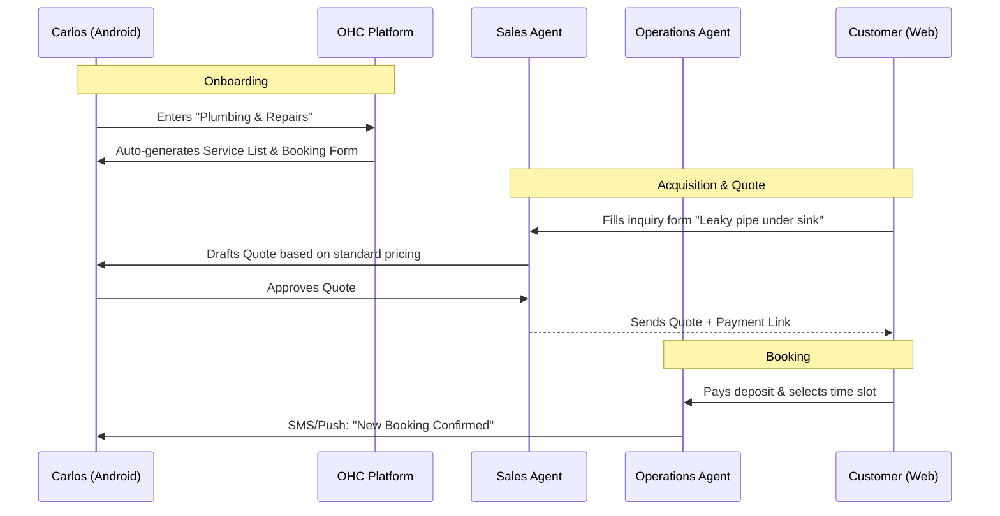
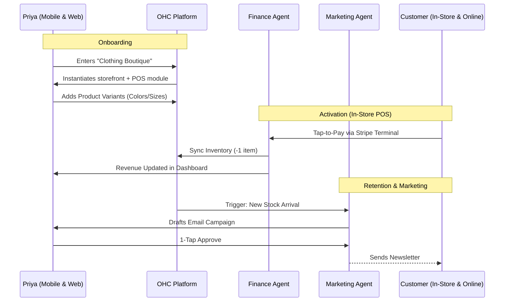
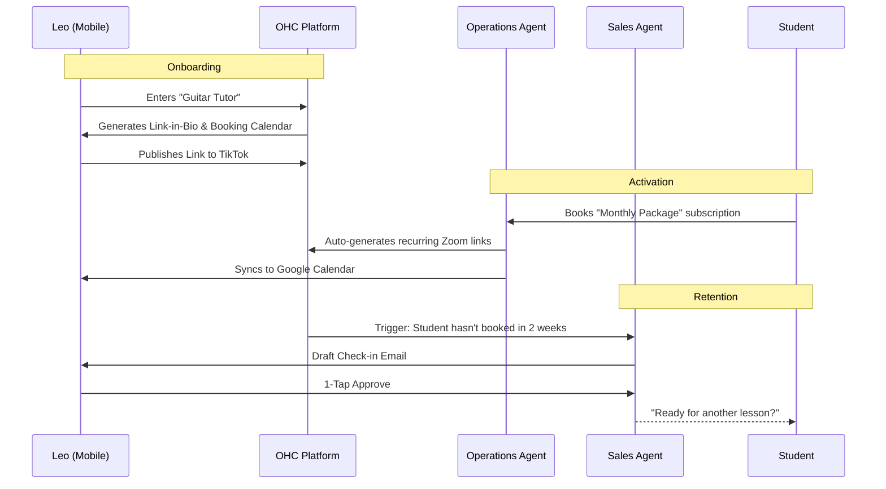
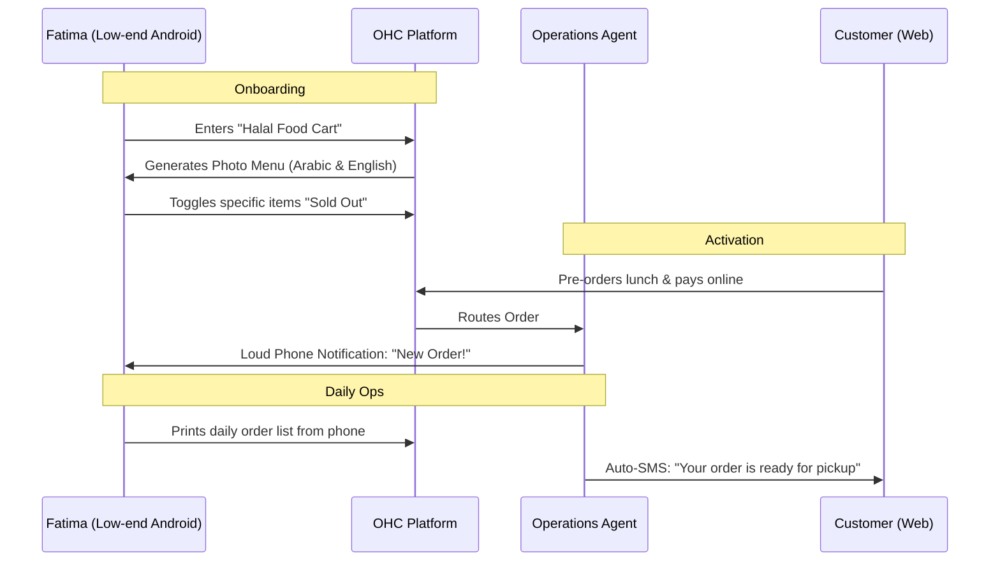

# [architecture] Business Journey Architecture: End-to-End Persona Flow

## 1. Problem Statement
Non-technical small business owners face significant friction when trying to set up, operate, and grow their businesses online. Current platforms (Shopify, Wix, Squarespace) require substantial technical configuration, time investment, and cognitive overhead. There is a need to define the complete, end-to-end user journey for diverse personas (e.g., Maya the baker, Carlos the handyman) using the OneHumanCorp (OHC) platform. This journey must illustrate how they can go from a conceptual idea to a live, functional, and AI-managed business in under 10 minutes, all from a mobile device.

## 2. Research Report
### Target Personas
1. **Maya (The Home Baker, 28)**: Needs a visually appealing storefront for custom cakes, deposit-based orders, and an AI to handle Instagram DMs while she sleeps. Uses an iPhone.
2. **Carlos (The Freelance Handyman, 42)**: Relies on word-of-mouth. Needs a service listing, booking calendar with deposits, customer inbox, and AI quote generation. Uses an Android device.
3. **Priya (The Boutique Owner, 35)**: Wants online presence synced with in-store inventory. Needs variants (size/color), tap-to-pay POS, and email marketing. Uses iPhone and MacBook.
4. **Leo (The Music Tutor, 22)**: Needs lesson booking with calendar sync, auto-generated meeting links, subscription packages, and a TikTok link-in-bio.
5. **Fatima (The Food Cart Operator, 50)**: Needs a photo menu, pre-order/pickup flow, simple order lists, Arabic/English support, and offline resilience on a low-end Android.

### Competitive Gap
- **Shopify/Wix/Squarespace**: Setup takes 30-60 minutes; requires low-to-medium technical knowledge; AI is often bolted-on (chatbots) rather than fundamental infrastructure. None are purely mobile-first for comprehensive management.
- **OHC Opportunity**: "Zero to live in under 10 minutes." 100% mobile-native management. AI operates as infrastructure (Departments) invisibly handling operations, marketing, sales, customer success, finance, legal, and advisory.

## 3. Design Doc: Business Journey Architectures

### 3.1 Overall Journey Stages
1. **Acquisition**: How the persona discovers OHC (e.g., TikTok ad, Instagram, word-of-mouth).
2. **Onboarding**: The rapid, AI-assisted wizard (under 10 mins). Focuses on "What do you sell?" and minimal essential data.
3. **Activation**: First "aha" moment (first product added, first payment received).
4. **Retention**: Ongoing value via AI Agents (e.g., automated DMs, weekly health reports, push notifications).
5. **Revenue**: Transition from Free to Paid tiers based on evident value.
6. **Referral**: Sharing the platform organically.

### 3.2 Maya (The Baker) Journey Diagram

### 3.3 Carlos (The Handyman) Journey Diagram

### 3.4 Priya (The Boutique Owner) Journey Diagram

### 3.5 Leo (The Music Tutor) Journey Diagram

### 3.6 Fatima (The Food Cart Operator) Journey Diagram

### 3.7 Key Friction Points & Mitigation
- **Friction**: Entering payment details during onboarding.
  - *Mitigation*: Defer payment setup until the first actual order is received (Stripe Connect).
- **Friction**: Creating a menu/catalog from scratch.
  - *Mitigation*: AI auto-generates a default catalog based on business type; user just takes photos on their phone.
- **Friction**: Understanding AI agent actions.
  - *Mitigation*: "Draft-for-Review" workflow for all external communications. Plain language approvals.

### 3.8 AI Integration Points
- **Onboarding**: "The Promoter" designs the initial site based on a 2-sentence description.
- **Acquisition**: "The Salesperson" generates quotes automatically.
- **Customer Success**: "The Ambassador" drafts replies to social media DMs.
- **Advisory**: "The Advisor" sends a weekly plain-text SMS: "You made $400 this week. Tuesdays are slow. Should we run a promo?"

## 4. Implementation Prompt
**Prompt for Implementer Agent:**
Implement the core Onboarding Wizard flow for the mobile (Flutter) client.
- **User-Facing Outcome**: A new user opens the app, is prompted for their business name and type (e.g., "Food Cart"), and the system uses the AI "Promoter" agent to instantly generate a draft storefront structure.
- **CUJ (Critical User Journey)**:
  1. User selects "Start a Business".
  2. Input: Business Name.
  3. Input: Business Type (Select from: Physical, Digital, Service, Food).
  4. Loading Screen: "AI is building your storefront..."
  5. Result: User lands on the Dashboard with a populated "Preview Site" button.
- **Acceptance Criteria**:
  - Must be fully responsive starting at 375px width.
  - Must not ask for banking details or custom domains in this initial step.
  - Must trigger the backend orchestrator to create a new `Tenant` and initiate the storefront generation background job.

## 5. Metadata
- **Priority**: P0
- **Estimated Scope**: Large
