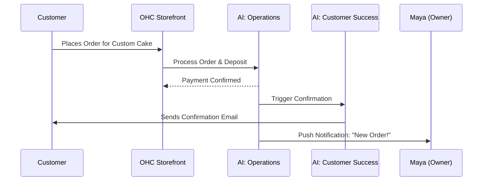
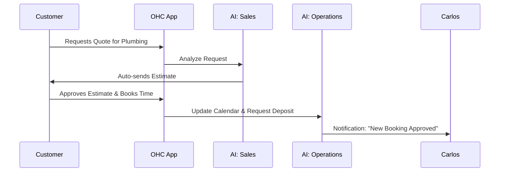
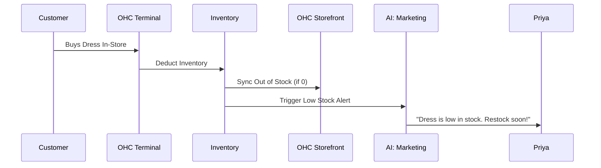
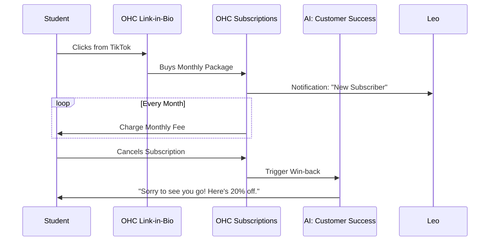
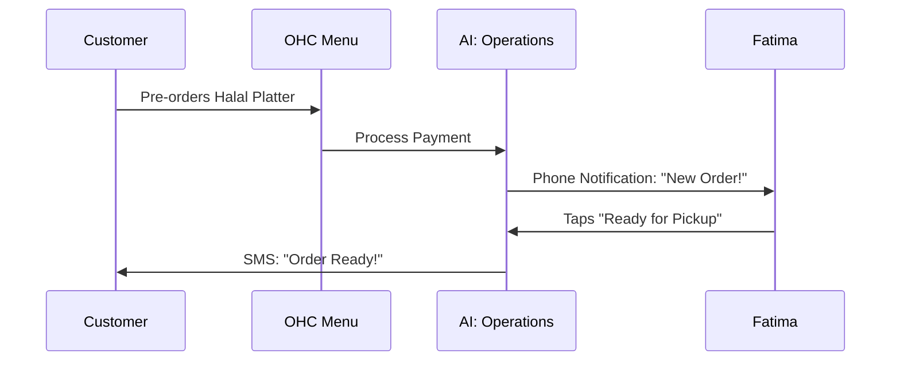

# Title: End-to-End Business Journey Architecture
## Problem Statement
Small business owners often abandon platforms because the process to launch and run their business is confusing and technical. They need a simple, guided experience from initial discovery to making their first sale and beyond, where AI invisibly handles the complexity.

## Research Report
Current platforms like Shopify and Wix require significant manual configuration, taking 30-60 minutes just to set up basic features. OHC differentiates by using AI to do the heavy lifting, allowing non-technical users to go from zero to a live business in under 10 minutes. This document maps out the end-to-end journey for our core personas.

## Design Doc

### 1. Acquisition
- **Maya (Baker)**: Discovers OHC via an Instagram ad showing a competitor easily managing custom orders on their phone.
- **Carlos (Handyman)**: Hears about OHC from a friend. Searches "easy booking app for handymen" and lands on our SEO-optimized page.
- **Priya (Boutique)**: Clicks an OHC link in another boutique's bio ("Powered by OHC").
- **Leo (Tutor)**: Finds an OHC tutorial on TikTok about setting up subscription packages.
- **Fatima (Food Cart)**: Sees an OHC sticker on another food cart offering "Scan to Pre-order."

**Landing Page CTA**: "Launch your business in 10 minutes. AI does the work." -> Starts Onboarding Wizard.

### 2. Onboarding Wizard
The onboarding flow is optimized for 375px mobile screens and requires minimal typing.

1. **Business Name & Type**: "What's the name of your business?" and "What do you do?" (e.g., "Maya's Cakes", "Baking").
2. **Goal Selection**: "What's your primary goal right now?" (Sell products online, Take bookings, Build a portfolio).
3. **AI Generation**: The "Marketing & Advertising" AI department generates a draft website, suggested product categories, and a preliminary brand identity based on the inputs.
4. **Review & Tweak**: User reviews the AI-generated storefront. Can easily swap themes or regenerate content.
5. **Payment Setup**: Connects a Stripe account or sets up a simple OHC payment link.

*Friction Point Mitigation*: If a user hesitates at payment setup, they can defer it and still publish their site as "Coming Soon" or collect leads.

### 3. Activation
Success is defined differently for each persona:
- **Maya**: Adds her first custom cake product and receives a deposit payment.
- **Carlos**: Sets his availability and gets his first booking inquiry.
- **Priya**: Syncs her inventory and publishes the online store.
- **Leo**: Creates his first subscription package and shares his link-in-bio.
- **Fatima**: Sets up her menu and enables pre-orders.

### 4. Retention
What keeps them coming back daily?
- **Push Notifications**: New orders, booking requests, or low inventory alerts.
- **Business Advisory AI**: Weekly health reports ("Your custom cakes are popular on weekends. Consider running a weekend special.").
- **Customer Success AI**: "You have 3 unanswered DMs. Should I reply with this draft?"
- **Simple Dashboard**: A quick glance at today's revenue, pending tasks, and recent activity.

### 5. Revenue
When do they upgrade from Free -> Starter/Pro?
- **Trigger**: Hitting the free tier limit (e.g., more than 10 products, needing a custom domain, or requiring more AI actions).
- **Upgrade CTA**: "You've reached your free product limit. Upgrade to Starter for unlimited products and a custom domain." Presented within the flow where the limit is hit, not hidden in settings.

### 6. Referral
How do they share OHC?
- **Viral Loop**: Every OHC-powered site has a subtle "Powered by OHC" link.
- **In-App Prompt**: After a successful sale, "Love OHC? Invite a friend and you both get a free month of Pro."
- **Social Sharing**: Easy tools to share their storefront or specific products directly to Instagram/TikTok with a pre-populated caption.

### Architecture Diagrams (Mermaid.js)

#### 1. Maya (Baker) - Custom Order Journey

#### 2. Carlos (Handyman) - Service Booking Journey

#### 3. Priya (Boutique) - In-store & Online Sync Journey

#### 4. Leo (Tutor) - Subscription & Link-in-Bio Journey

#### 5. Fatima (Food Cart) - Pre-Order & Pickup Journey

## Implementation Prompt
**For Implementer Agent:**
Implement the Onboarding Wizard flow for the mobile app (Flutter/PWA). The wizard must collect the business name, type, and primary goal, then trigger the AI to generate a draft storefront. Ensure the UI follows the OHC Premium Design Tokens (Glassmorphism, Outfit/Inter). The user must be able to review the AI-generated draft, make simple adjustments, and connect their payment provider (or defer). The final output should be a live "Coming Soon" or active storefront. Implement this with 100% E2E test coverage starting from the app launch.

## Priority: P0
## Estimated Scope: Large
